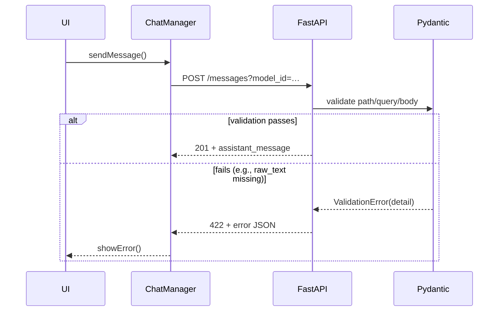

# Plan: Diagnose & Fix HTTP 422 during `POST /api/…/messages`

## 1  Understand 422 in FastAPI / Pydantic
| Area | Typical Cause | Where to check |
|------|---------------|----------------|
| Query params | Missing/invalid (`model_id`, `conversation_id` not UUID) | `routes/unified_conversations.py` param signatures |
| Path params | Wrong UUID format | Browser request URL |
| JSON body -> `MessageCreate` | • Missing `raw_text`  <br>• `role` not `"user"`/`"assistant"` <br>• `image_data` exceeds Base64 size <br>• `thinking_budget` outside `1024-32000` | Network tab request payload / server traceback |
| Dependency validation | `validate_model_and_params` rejects (`model_id` unsupported, too-high `temperature`) | Server log `validate_model_and_params` |
| Business validation | Project access / KB missing | Server log, 400 or 422 detail |

FastAPI returns **422** if:
* Pydantic cannot coerce/validate request **before** reaching route body
* Dependencies raise `HTTPException(status_code=422, …)`

## 2  Capture Full Request / Response

### Frontend – Network panel
1. Keep **Preserve log**.
2. Select failing **POST …/messages**.
3. Tabs:
   * **Headers** – confirm query/path params.
   * **Payload** – JSON body.
   * **Response** – FastAPI error JSON (`detail` shows field errors).

### Backend – Enable debug logging
Add (if not already):
```py
import uvicorn
if __name__ == "__main__":
    uvicorn.run("main:app", reload=True, log_level="debug")
```
Look for log entry:
```
422 UnprocessableEntity
{"loc": ["body","new_msg","raw_text"], "msg": "field required", …}
```

To print incoming body quick patch:
```py
@app.middleware("http")
async def log_body(request: Request, call_next):
    if request.url.path.endswith("/messages"):
        body = await request.json()
        logger.debug("Incoming body %s", body)
    response = await call_next(request)
    return response
```

## 3  Client-side sanity checks
1. In `chat.js::_sendMessageToAPI` ensure:
   * `raw_text` non-empty   ✔️ line 570
   * `role` `"user"`         ✔️ line 572
   * `payload.image_data` only when set and size checked (line 581)
2. Verify **query param** `model_id` matches backend allowed list.
3. Confirm `thinking_budget`, `max_tokens`, etc. only sent when truthy.

Add defensive check:
```js
if (!/^[0-9a-f-]{36}$/.test(this.currentConversationId)) {
  throw new Error("Bad conversation ID");
}
```

## 4  Server-side debugging steps
1. **Reproduce locally with cURL**
   ```bash
   curl -X POST http://localhost:8000/api/projects/$PID/conversations/$CID/messages?model_id=claude-3-sonnet-20240229 \
        -H 'Authorization: Bearer …' \
        -H 'Content-Type: application/json' \
        -d '{"raw_text":"hi","role":"user"}' -v
   ```
   Reduce payload until it passes → the field removed last is culprit.

2. **Inspect validation model** `MessageCreate`
   * Relax constraints if legitimate values exceed bounds.
   * If optional fields should accept `null`, set `default=None` not `Field(None, …)`.

3. **Check dependency** `validate_model_and_params`
   * Ensure `model_id` accepted list includes `"claude-3-sonnet-20240229"`.

## 5  Potential Fixes
| Finding | Fix |
|---------|-----|
| Missing `enable_thinking` default `False` in request → backend expects bool | In `chat.js::_sendMessageToAPI` always include `enable_thinking:false` |
| Pydantic complains `image_data` too large | Enforce `CHAT_CONFIG.MAX_IMAGE_SIZE` (already) OR raise `HTTP 413` instead of 422 |
| `model_id` not in whitelist | Add to whitelist or map client string to backend id |
| Invalid `thinking_budget` | Clamp in client to 1024-32000 before sending |
| Frontend sends extra keys (camelCase vs snake) | Match backend: use `enable_web_search` not `enableWebSearch` |

## 6  Mermaid Trace


## 7  Next Steps
1. Re-run with dev tools and copy `detail` from 422 JSON.
2. Apply corresponding fix from table §5.
3. Retest until 201 created.
