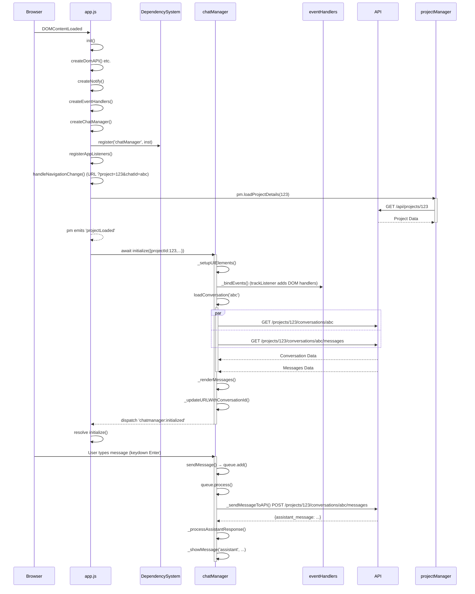

# Azure OpenAI Chat Application

A full-stack, project-based chat and knowledge management application leveraging Azure OpenAI, Anthropic Claude, JWT authentication, and modular ES6 frontend with Tailwind CSS and DaisyUI.

## Features

- Project-based organization: each user can manage multiple projects
- Real-time chat with AI models (Claude, GPT, Azure OpenAI, etc.)
- JWT authentication with secure HttpOnly cookies and CSRF protection
- File and artifact management per project
- Knowledge base per project with file upload, search, and reindexing
- Modular, event-driven frontend (ES6 modules, DependencySystem DI)
- Tailwind CSS with DaisyUI for theming
- Sentry integration for error and performance monitoring (backend & frontend)
- Docker-based deployment and local development support

## Project Structure

```
azure_chatapp/
├── models/                # Database models (User, Project, Conversation, File, Artifact, KnowledgeBase, etc.)
├── routes/                # API endpoints (auth, projects, files, artifacts, knowledge base, conversations, preferences, sentry test)
│   ├── projects/          # Project subroutes (projects.py, files.py, artifacts.py)
│   ├── knowledge_base_routes.py
│   ├── unified_conversations.py
│   ├── user_preferences.py
│   ├── sentry_test.py
│   └── admin.py
├── services/              # Business logic/services (conversation_service, project_service, file_storage, knowledgebase_service, etc.)
├── db/                    # Database connection and session management (db.py)
├── utils/                 # Shared utilities (auth_utils, db_utils, sentry_utils, serializers, etc.)
├── static/                # Frontend assets
│   ├── html/              # HTML templates (base.html, project_list.html, project_details.html, modals.html)
│   ├── js/                # ES6 modules (app.js, projectManager.js, chat.js, modelConfig.js, etc.)
│   └── css/               # Tailwind styles
├── config.py              # Application configuration (insecure/debug for local/dev)
├── main.py                # FastAPI application entrypoint
├── requirements.txt       # Python dependencies
└── package.json           # Frontend dependencies and scripts
```

## Core API Endpoints

### Authentication
```http
POST /api/auth/login
Content-Type: application/json

{
  "email": "user@example.com",
  "password": "securepassword"
}

Response:
{
  "access_token": "jwt.token.here",
  "refresh_token": "refresh.token.here",
  "expires_in": 3600,
  "token_type": "bearer"
}
```

### Project Management
```http
POST /api/projects
Content-Type: application/json
Authorization: Bearer {token}

{
  "name": "AI Research",
  "description": "Market analysis project"
}

Response:
{
  "id": 123,
  "name": "AI Research",
  "description": "Market analysis project",
  "created_at": "2025-03-16T22:38:22Z"
}

GET /api/projects/123
Authorization: Bearer {token}

Response:
{
  "id": 123,
  "name": "AI Research",
  "description": "Market analysis project",
  "attached_chats": ["chat_abc123"],
  "files": ["report.pdf"]
}
```

### Real-time Chat
```http
WebSocket wss://yourapp.com/chat
Headers:
Authorization: Bearer {token}

Message Format:
{
  "project_id": 123,
  "message": "Analyze Q4 trends",
  "context": {"temperature": 0.7}
}

Response Stream:
{
  "content": "Q4 shows 15% growth...",
  "tokens_used": 42,
  "is_complete": false
}
```

## Frontend Architecture

- Modular ES6 codebase with strict dependency injection (`DependencySystem`)
- Main entrypoint: `static/js/app.js`
- Core modules: `projectManager.js`, `chat.js`, `modelConfig.js`, `projectDashboard.js`, `projectListComponent.js`, `projectDetailsComponent.js`, `sidebar.js`, `knowledgeBaseComponent.js`
- UI is dynamically injected/enhanced after DOM and dependencies are ready
- Sentry monitoring for frontend errors and performance

## Deployment

```bash
# Build production image
docker build -t azure-chatapp:prod --target production .

# Run with environment variables
docker run -d -p 80:80 \
  -e DATABASE_URL="postgresql+asyncpg://user:pass@db:5432/azure_chatapp?sslmode=disable" \
  -e SESSION_SECRET="your-session-secret" \
  -e JWT_SECRET="your-jwt-secret" \
  azure-chatapp:prod
```

## Development Setup

```bash
# Backend
python -m venv venv
source venv/bin/activate
pip install -r requirements.txt

# Frontend
npm install
npm run watch:css

# Start FastAPI app
uvicorn main:app --reload
```

> **WARNING:** This codebase uses insecure/debug configuration by default (relaxed CORS, cookies, and session settings). Do NOT use in production without hardening security settings in `config.py` and environment variables.

## Architectural Diagrams

### Chat Initialization Block Diagram

```mermaid
graph TD
    A[app.js] -->|import| B(DependencySystem)
    A --"init()"--> Stage1(1. Core DI creation)
    Stage1 --> Stage2(2. createNotify)
    Stage2 --> Stage3(3. createEventHandlers)
    Stage3 --> Stage4(4. createApiClient)
    Stage4 --> Stage5(5. createChatManager)
    B -.->|register(...)| A
    Stage3 ---> Stage5
    Stage5 --> Stage6(6. createProjectManager)
    Stage6 --> Stage7(7. UI bootstrap)
    A -.->|"DOM ready ⇢ waitForDepsAndDom() (async)"| RegListeners(registerAppListeners)
    RegListeners --> NavChange(trackListener window, locationchange → handleNavigationChange)
    RegListeners --> ChatTrigger(setupChatInitializationTrigger)
    RegListeners --> GlobalHooks(global auth / error hooks)
```

### Chat Sequence Diagram: First Page Load → First Message



## Contributing
1. Create feature branch: `git checkout -b feature/your-idea`
2. Commit changes: `git commit -am 'Add awesome feature'`
3. Push branch: `git push origin feature/your-idea`
4. Open pull request

[Response interrupted by a tool use result. Only one tool may be used at a time and should be placed at the end of the message.]
