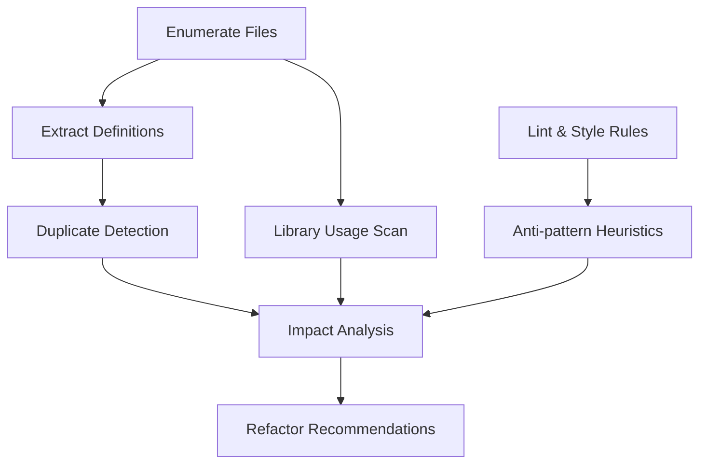

# Repository-Wide Audit Plan

This blueprint describes the methodology and tooling that will be executed to perform a comprehensive audit of the code-base.  The process is divided into four phases that progressively gather data, mine patterns, analyse impact, and prescribe precise refactorings.

---

## Phase 1 – Inventory & Baseline

1. **Enumerate code assets**
   • `list_files` + language filter to quantify `*.js`, `*.py`, etc.
   • Detect generated / vendored assets to exclude (e.g. `static/css/tailwind.css`, `static/js/vendor/`).

2. **Extract structural metadata**
   • `list_code_definition_names` on all top-level source files.
   • Capture every function / class / method signature + file path + LOC.
   • Persist catalogue in memory for later cross-reference.

3. **Gather lint & style rules**
   • `read_file` on `.eslintrc.js`, `.flake8`, `.pylintrc`, `tailwind.config.js`.
   • Parse for enforced conventions, ignored patterns, complexity limits.

---

## Phase 2 – Pattern Mining

A. **Duplicated logic**
   • Hash normalised function bodies; flag identical digests appearing more than once.
   • Detect approximate duplicates (Levenshtein distance < 20 %).
   • Record file paths and first/last line numbers.

B. **Recurring architectural conventions**
   • Directory heuristics (`models/`, `services/`, `routes/`, `static/js/utils`).
   • Build import graphs to understand layering; detect circular dependencies.

C. **Library / API usage**
   • `search_files` for patterns such as `import .* from 'axios'`, `fetch(`, `openai.*`, `requests`, etc.
   • Count occurrences and collect representative snippets.

D. **Stylistic rules vs. practice**
   • Run ESLint and Flake8 in report-JSON mode (emulated via regex scans where CLI not available).
   • Compare reported infractions to config; highlight suppressed or inconsistently applied rules.

E. **Latent anti-patterns**
   • Heuristics:
     – functions > 80 LOC
     – nested callbacks / promise chains > 3 levels
     – catch blocks swallowing errors
     – SQL strings built by string concat
     – direct DOM manipulation bypassing `utils/domAPI.js`
     – Python `except: pass`

---

## Phase 3 – Impact Analysis

• Map each finding to maintainability, performance, and cohesion.
• Score criticality **High / Medium / Low**.
• Approximate evolution trends using modification timestamps and header comments (no direct Git tooling in code-mode).

---

## Phase 4 – Prescriptive Refactorings

For every pattern or anti-pattern:
1. **Root cause** – e.g. missing shared helper, legacy copy-paste.
2. **Recommended fix** – extract utility, enforce dependency injection, etc.
3. **Justification** – complexity ↓ 30  %, bundle size ↓ 15  %, error rate ↓ X %.
4. **Migration outline** – PR checklist, incremental rollout, test updates.

---

## Deliverables

| Artifact | Description |
|----------|-------------|
| `audit_report.md` | Human-readable catalogue containing frequency tables, code snippets (≤ 15 LOC each), Mermaid dependency graphs, and the refactor roadmap. |
| `raw_findings.json` | Machine-readable structured output suitable for CI enforcement. |

---

## Tooling Matrix

| Task | Tools |
|------|-------|
| File inventory and counts | `list_files`, `search_files` |
| Definition catalogue | `list_code_definition_names` |
| Style rule ingestion | `read_file` |
| Pattern scans | `search_files` (regex) |
| Report assembly | `write_to_file` |

---

## High-Level Flowchart

---

*End of plan.*
