# Codebase Research Report

## Query
Follow the first 20 dependencies that must be satisfied before the application can be used

## Answer
### System Diagram

```mermaid
graph LR
    subgraph Application_Setup_subgraph ["Application Setup"]
        dependencyManager_node["Dependency Management<br>requirements.txt"]
        webFramework_node["Web Framework<br>fastapi"]
        asgiServer_node["ASGI Server<br>uvicorn[standard]"]
        rateLimiter_node["Rate Limiting<br>slowapi"]
        dataValidation_node["Data Validation<br>pydantic"]
        httpClient_node["HTTP Client<br>httpx"]
        multipartParser_node["Multipart Form Data<br>python-multipart"]
        asyncFileIO_node["Asynchronous File I/O<br>aiofiles"]
    end
    subgraph Database_Integration_subgraph ["Database Integration"]
        sqlToolkit_node["SQL Toolkit & ORM<br>sqlalchemy"]
        concurrencyLib_node["Concurrency Library<br>greenlet"]
        asyncPostgres_node["Async PostgreSQL Client<br>asyncpg"]
        postgresAdapter_node["PostgreSQL Adapter<br>psycopg2-binary"]
    end
    subgraph Security_and_Utilities_subgraph ["Security and Utilities"]
        jwtHandler_node["JWT Handling<br>PyJWT"]
        errorTracking_node["Error Tracking<br>sentry-sdk"]
        systemInfo_node["System Information<br>psutil"]
        markdownParser_node["Markdown Parsing<br>markdown2"]
        htmlSanitizer_node["HTML Sanitization<br>bleach"]
        consoleStyling_node["Console Styling<br>colorama"]
    end
    subgraph OpenAI_Integration_subgraph ["OpenAI Integration"]
        tokenizer_node["Tokenizer<br>tiktoken"]
        openaiAPI_node["OpenAI API<br>openai"]
    end
    dependencyManager_node --> |"installs"| webFramework_node
    dependencyManager_node --> |"installs"| asgiServer_node
    dependencyManager_node --> |"installs"| rateLimiter_node
    dependencyManager_node --> |"installs"| dataValidation_node
    dependencyManager_node --> |"installs"| httpClient_node
    dependencyManager_node --> |"installs"| multipartParser_node
    dependencyManager_node --> |"installs"| asyncFileIO_node
    dependencyManager_node --> |"installs"| sqlToolkit_node
    dependencyManager_node --> |"installs"| concurrencyLib_node
    dependencyManager_node --> |"installs"| asyncPostgres_node
    dependencyManager_node --> |"installs"| postgresAdapter_node
    dependencyManager_node --> |"installs"| jwtHandler_node
    dependencyManager_node --> |"installs"| errorTracking_node
    dependencyManager_node --> |"installs"| systemInfo_node
    dependencyManager_node --> |"installs"| markdownParser_node
    dependencyManager_node --> |"installs"| htmlSanitizer_node
    dependencyManager_node --> |"installs"| consoleStyling_node
    dependencyManager_node --> |"installs"| tokenizer_node
    dependencyManager_node --> |"installs"| openaiAPI_node
```

### Summary
# CodeViz [First 20 Dependencies]

The first 20 dependencies listed in `requirements.txt` are:

- **fastapi** (file:requirements.txt:2)
- **uvicorn[standard]** (file:requirements.txt:3)
- **slowapi** (file:requirements.txt:4)
- **pydantic** (file:requirements.txt:7)
- **httpx** (file:requirements.txt:10)
- **python-multipart** (file:requirements.txt:11)
- **aiofiles** (file:requirements.txt:12)
- **sqlalchemy** (file:requirements.txt:15)
- **greenlet** (file:requirements.txt:16)
- **asyncpg** (file:requirements.txt:17)
- **psycopg2-binary** (file:requirements.txt:18)
- **PyJWT** (file:requirements.txt:21)
- **sentry-sdk** (file:requirements.txt:24)
- **psutil** (file:requirements.txt:25)
- **markdown2** (file:requirements.txt:28)
- **bleach** (file:requirements.txt:29)
- **colorama** (file:requirements.txt:32)
- **tiktoken** (file:requirements.txt:35)
- **openai** (file:requirements.txt:36)
- **numpy** (file:requirements.txt:39)

## Walkthrough Steps

### 1. Initial Dependency Setup
The application requires several dependencies to be installed before it can be used. These dependencies, listed in `requirements.txt`, provide essential functionalities for the application to run correctly. The first 20 dependencies are crucial for setting up the application environment.

### 2. Installing FastAPI
The first dependency, `fastapi`, is a modern, high-performance web framework for building APIs with Python. It simplifies the process of creating robust and scalable web applications.

### 3. Installing Uvicorn
`uvicorn[standard]` is an ASGI server that is used to run the `fastapi` application. It provides a production-ready environment for handling asynchronous requests.

### 4. Installing SlowAPI
`slowapi` is used for rate limiting in `fastapi` applications. It helps to prevent abuse and ensure fair usage of the API.

### 5. Installing Pydantic
`pydantic` is a data validation and settings management library. It is used to define data structures and validate incoming data in `fastapi` applications.

### 6. Installing HTTPX
`httpx` is an HTTP client library that provides both synchronous and asynchronous request capabilities. It is used for making HTTP requests to external services.

### 7. Installing Python-Multipart
`python-multipart` supports parsing multipart form data, which is commonly used for file uploads in web applications.

### 8. Installing AIOFiles
`aiofiles` provides asynchronous file I/O operations, allowing the application to efficiently handle file-related tasks.

### 9. Installing SQLAlchemy
`sqlalchemy` is a powerful SQL toolkit and ORM that provides a way to interact with databases using Python objects.

### 10. Installing Greenlet
`greenlet` is a concurrent programming library that enables lightweight coroutines, improving the efficiency of asynchronous operations.

### 11. Installing AsyncPG
`asyncpg` is an asynchronous PostgreSQL client library that provides high-performance database connectivity.

### 12. Installing Psycopg2-Binary
`psycopg2-binary` is another PostgreSQL adapter for Python. It's a binary version, which simplifies installation.

### 13. Installing PyJWT
`PyJWT` is a library for encoding and decoding JSON Web Tokens (JWT), which are used for authentication and authorization.

### 14. Installing Sentry-SDK
`sentry-sdk` is used for error tracking and performance monitoring, helping to identify and resolve issues in the application.

### 15. Installing PSUtil
`psutil` provides an interface for retrieving system information, such as CPU usage, memory usage, and disk usage.

### 16. Installing Markdown2
`markdown2` is a Markdown parser that converts Markdown text into HTML.

### 17. Installing Bleach
`bleach` is a library for sanitizing HTML, removing potentially harmful tags and attributes.

### 18. Installing Colorama
`colorama` is a library for adding colors and styles to console output.

### 19. Installing Tiktoken
`tiktoken` is a fast BPE tokeniser for use with OpenAI's models.

### 20. Installing OpenAI
`openai` is the OpenAI Python library, providing convenient access to the OpenAI API.

### 21. Installing NumPy
`numpy` is a fundamental package for numerical computation in Python, providing support for arrays, matrices, and mathematical functions.

## Detailed Sub-Search Results

### 1. Find the first 20 dependencies listed in requirements.txt
Here are the first 20 dependencies listed in `requirements.txt`:

*   fastapi (file:requirements.txt:2)
*   uvicorn[standard] (file:requirements.txt:3)
*   slowapi (file:requirements.txt:4)
*   pydantic (file:requirements.txt:7)
*   httpx (file:requirements.txt:10)
*   python-multipart (file:requirements.txt:11)
*   aiofiles (file:requirements.txt:12)
*   sqlalchemy (file:requirements.txt:15)
*   greenlet (file:requirements.txt:16)
*   asyncpg (file:requirements.txt:17)
*   psycopg2-binary (file:requirements.txt:18)
*   PyJWT (file:requirements.txt:21)
*   sentry-sdk (file:requirements.txt:24)
*   psutil (file:requirements.txt:25)
*   markdown2 (file:requirements.txt:28)
*   bleach (file:requirements.txt:29)
*   colorama (file:requirements.txt:32)
*   tiktoken (file:requirements.txt:35)
*   openai (file:requirements.txt:36)
*   numpy (file:requirements.txt:39)

---
*Generated by [CodeViz.ai](https://codeviz.ai) on 6/11/2025, 2:32:39 AM*
