# Codebase Research Report

## Query
Investigate the "File Upload API" component in detail. Focus your analysis on these key files:
1. files.py (azure_chatapp/routes/projects/files.py)

Provide insights about the component's main responsibilities and functionality and how it integrates with other system components

## Answer
### System Diagram

```mermaid
graph TB
    subgraph fileUpload_subgraph["File Upload API"]
        apiEndpoint_node["API Endpoint<br>handle_upload_project_file"]
        projectRetrieval_node["Project Retrieval<br>file_service.get_by_id,ensure_project_has_knowledge_base"]
        fileProcessing_node["File Processing & Validation<br>_process_upload_file_info,_read_file_contents,FileValidator.validate_size"]
        tokenValidation_node["Token Estimation & Validation<br>_estimate_file_tokens,TokenManager.validate_usage"]
        fileStorage_node["File Storage & Record Creation<br>_store_file,StorageManager,_create_file_record,save_model,TokenManager.update_usage"]
        kbIndexing_node["Knowledge Base Indexing<br>background_tasks.add_task,knowledgebase_service"]
    end
    apiEndpoint_node --> |"retrieves"| projectRetrieval_node
    projectRetrieval_node --> |"processes & validates"| fileProcessing_node
    fileProcessing_node --> |"validates"| tokenValidation_node
    tokenValidation_node --> |"stores & creates record"| fileStorage_node
    fileStorage_node --> |"adds task to"| kbIndexing_node
```

### Summary
Okay, I have a good understanding of the `handle_upload_project_file` function and its interactions. Now, let's consolidate this information and create the final Markdown report.

# CodeViz File Upload API

## Overview

This report details the "File Upload API" component, focusing on the `azure_chatapp/routes/projects/files.py` file. This component provides API endpoints for managing files within a project.

## Key Files

*   `azure_chatapp/routes/projects/files.py`: Defines the API endpoints for file management.
*   `azure_chatapp/services/file_service.py`: Contains the core logic for handling file uploads, storage, and metadata management.

## API Endpoints (defined in `files.py`)

*   `handle_upload_project_file`: Handles the upload of a file to a project.
*   `list_project_files`: Lists files associated with a project.
*   `get_project_file_metadata`: Retrieves metadata for a specific file in a project.
*   `delete_project_file`: Deletes a file from a project.
*   `download_project_file`: Downloads a file from a project.

## `handle_upload_project_file` Function Details

The `handle_upload_project_file` function is responsible for handling the file upload process. Here's a breakdown of the steps involved, primarily orchestrated by the `file_service`:

1.  **Project and Knowledge Base Retrieval:**
    *   Retrieves the project from the database using `get_by_id(self.db, Project, project_id)` (file:azure_chatapp/services/file_service.py:77).
    *   If `index_kb` is `True`, it ensures the project has a knowledge base by calling `ensure_project_has_knowledge_base(project_id, self.db, user_id)` (file:azure_chatapp/services/file_service.py:86).

2.  **File Processing and Validation:**
    *   Processes the uploaded file information using `self._process_upload_file_info(file)` (file:azure_chatapp/services/file_service.py:91).
    *   Reads the file contents in chunks using `self._read_file_contents(file)` (file:azure_chatapp/services/file_service.py:94).
    *   Validates the file size using `FileValidator.validate_size(len(contents))` (file:azure_chatapp/services/file_service.py:97).

3.  **Token Estimation and Validation:**
    *   Estimates the number of tokens in the file using `self._estimate_file_tokens(contents, file_info["sanitized_filename"])` (file:azure_chatapp/services/file_service.py:107).
    *   Validates that the project has enough token capacity using `TokenManager.validate_usage(project, token_data["token_estimate"])` (file:azure_chatapp/services/file_service.py:110).

4.  **File Storage and Database Record Creation:**
    *   Stores the file using `self._store_file(contents, project_id, file_info["sanitized_filename"])` (file:azure_chatapp/services/file_service.py:123). This interacts with the `StorageManager`.
    *   Creates a database record for the file using `self._create_file_record(project_id, file_info, stored_path, len(contents), token_data)` (file:azure_chatapp/services/file_service.py:128).
    *   Saves the file record to the database using `save_model(self.db, project_file)` (file:azure_chatapp/services/file_service.py:131).
    *   Updates the project's token usage using `TokenManager.update_usage(project, token_data["token_estimate"], self.db)` (file:azure_chatapp/services/file_service.py:132).

5.  **Knowledge Base Indexing (Background Task):**
    *   If `index_kb` is `True`, it adds a background task to process the file for search using `background_tasks.add_task(process_single_file_for_search, ...)` (file:azure_chatapp/services/file_service.py:139). This task is handled by the `knowledgebase_service`.

## Component Interactions

*   **`file_service`:** Orchestrates the entire file upload process.
*   **`StorageManager`:** Used by `file_service` to store the file in the configured storage backend.
*   **`TokenManager`:** Used by `file_service` to validate and update token usage.
*   **Database:** `file_service` interacts with the database to retrieve project information, create file records, and update token usage.
*   **`knowledgebase_service`:** `file_service` interacts with this (via a background task) to index the file content in the knowledge base (if `index_kb` is `True`).
*   **`FileValidator`:** Used by `file_service` to validate the file size and type.

## Walkthrough Steps

### 1. File Upload API Endpoint: `handle_upload_project_file`
The `handle_upload_project_file` function in `files.py` serves as the API endpoint for uploading files to a specific project. It orchestrates the entire file upload process, relying heavily on the `file_service` to manage the underlying operations.

### 2. Project and Knowledge Base Retrieval
The `file_service` begins by retrieving the project from the database using `get_by_id`. If the `index_kb` flag is set to `True`, the service ensures the project has an associated knowledge base by calling `ensure_project_has_knowledge_base`. This step prepares the project context for file processing and indexing.

### 3. File Processing and Validation
The uploaded file undergoes processing and validation. The `_process_upload_file_info` function extracts relevant file metadata. The file contents are read in chunks using `_read_file_contents`. The `FileValidator.validate_size` method checks if the file size adheres to the allowed limits.

### 4. Token Estimation and Validation
To manage token usage, the service estimates the number of tokens required for the file's content using `_estimate_file_tokens`. It then validates that the project has sufficient token capacity using `TokenManager.validate_usage`. This ensures that uploading the file won't exceed the project's token limits.

### 5. File Storage and Database Record Creation
The validated file is stored using `_store_file`, which interacts with the `StorageManager` to handle the actual storage. A database record for the file is created using `_create_file_record` and saved to the database using `save_model`. The project's token usage is updated using `TokenManager.update_usage` to reflect the new file's token consumption.

### 6. Knowledge Base Indexing (Background Task)
If `index_kb` is `True`, a background task is added to process the file for search using `background_tasks.add_task`. This task is handled by the `knowledgebase_service` and ensures that the file's content is indexed for efficient search within the knowledge base.

## Detailed Sub-Search Results

### 1. Detail the steps involved in `handle_upload_project_file`, including interactions with other services like `file_service`, `index_kb`, and database operations. (LoA: mid)
6.  **Detailed Analysis of `FileService.upload`:**

Here's a more detailed breakdown of the `FileService.upload` method (file:azure_chatapp/services/file_service.py:54):

*   **Project and Knowledge Base Retrieval:**
    *   Retrieves the project from the database using `get_by_id(self.db, Project, project_id)` (file:azure_chatapp/services/file_service.py:77).
    *   If `index_kb` is `True`, it ensures the project has a knowledge base by calling `ensure_project_has_knowledge_base(project_id, self.db, user_id)` (file:azure_chatapp/services/file_service.py:86). This function likely creates a knowledge base if one doesn't exist.

*   **File Processing and Validation:**
    *   Processes the uploaded file information using `self._process_upload_file_info(file)` (file:azure_chatapp/services/file_service.py:91). This includes sanitizing the filename and determining the file type.
    *   Reads the file contents in chunks using `self._read_file_contents(file)` (file:azure_chatapp/services/file_service.py:94) to handle large files efficiently.
    *   Validates the file size using `FileValidator.validate_size(len(contents))` (file:azure_chatapp/services/file_service.py:97).

*   **Token Estimation and Validation:**
    *   Estimates the number of tokens in the file using `self._estimate_file_tokens(contents, file_info["sanitized_filename"])` (file:azure_chatapp/services/file_service.py:107).
    *   Validates that the project has enough token capacity using `TokenManager.validate_usage(project, token_data["token_estimate"])` (file:azure_chatapp/services/file_service.py:110).

*   **File Storage and Database Record Creation:**
    *   Stores the file using `self._store_file(contents, project_id, file_info["sanitized_filename"])` (file:azure_chatapp/services/file_service.py:123). This method interacts with the `StorageManager` to save the file to the configured storage backend (local or cloud).
    *   Creates a database record for the file using `self._create_file_record(project_id, file_info, stored_path, len(contents), token_data)` (file:azure_chatapp/services/file_service.py:128).
    *   Saves the file record to the database using `save_model(self.db, project_file)` (file:azure_chatapp/services/file_service.py:131).
    *   Updates the project's token usage using `TokenManager.update_usage(project, token_data["token_estimate"], self.db)` (file:azure_chatapp/services/file_service.py:132).

*   **Knowledge Base Indexing (Background Task):**
    *   If `index_kb` is `True`, it adds a background task to process the file for search using `background_tasks.add_task(process_single_file_for_search, ...)` (file:azure_chatapp/services/file_service.py:139). This task is handled by the `knowledgebase_service` and involves extracting text from the file and indexing it in the knowledge base.

**Summary of Interactions:**

*   **`file_service`:** Orchestrates the entire file upload process.
*   **`file_service` interacts with `StorageManager`:** to store the file in the configured storage backend.
*   **`file_service` interacts with `TokenManager`:** to validate and update token usage.
*   **`file_service` interacts with the database:** to retrieve project information, create file records, and update token usage.
*   **`file_service` interacts with `knowledgebase_service` (via background task):** to index the file content in the knowledge base (if `index_kb` is `True`).
*   **`file_service` interacts with `FileValidator`:** to validate the file size and type.

---
*Generated by [CodeViz.ai](https://codeviz.ai) on 6/8/2025, 11:26:58 PM*
