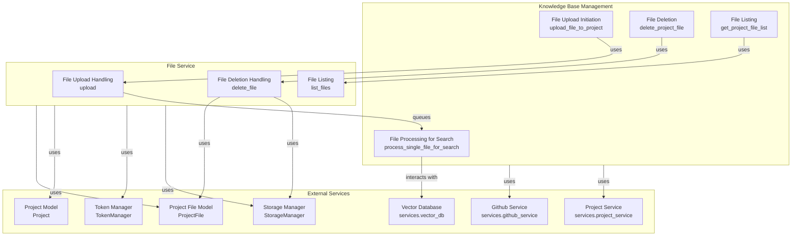

# Codebase Research Report

## Query
Investigate the "Knowledge Base Indexing" component in detail. Focus your analysis on these key files:
1. file_service.py (azure_chatapp/services/file_service.py)
2. knowledgebase_service.py (azure_chatapp/services/knowledgebase_service.py)

Provide insights about the component's main responsibilities and functionality and how it integrates with other system components

## Answer
### System Diagram



### Summary
# CodeViz Knowledge Base Indexing Component Analysis

## Overview

This report analyzes the "Knowledge Base Indexing" component, focusing on `file_service.py` (azure_chatapp/services/file_service.py) and `knowledgebase_service.py` (azure_chatapp/services/knowledgebase_service.py). It provides insights into the component's responsibilities, functionality, and integration with other system components.

## file_service.py Analysis

### Main Responsibilities and Functions

-   **Main Responsibility:** Provides a unified service for file operations (upload, delete, list, metadata) within the application, specifically in the context of projects and knowledge bases (file:azure_chatapp/services/file_service.py:4) (node:FileService_Main).
-   **File Upload and Indexing:**
    -   The `upload` method (file:azure_chatapp/services/file_service.py:54) handles file uploads. It takes an `index_kb` flag as input. If `index_kb` is True, the file is intended to be indexed in the knowledge base.
    -   When `index_kb` is True, the `upload` method ensures a knowledge base exists for the project (file:azure_chatapp/services/file_service.py:86).
    -   It then queues a background task (`process_single_file_for_search`) to handle the actual indexing process. This background task is handled by `knowledgebase_service.py` (file:azure_chatapp/services/file_service.py:137).
-   **Token Management:** Estimates the number of tokens in a file using `_estimate_file_tokens` (file:azure_chatapp/services/file_service.py:310) and validates if the project has enough capacity using `TokenManager`. This is important for managing the cost associated with indexing large files.
-   **File Storage:** Stores the uploaded file using `StorageManager` (file:azure_chatapp/services/file_service.py:335) and creates a record in the `ProjectFile` table (file:azure_chatapp/services/file_service.py:346).
-   **File Deletion:** The `delete_file` method (file:azure_chatapp/services/file_service.py:246) deletes the file from storage and removes the corresponding record from the database. The cleanup of vector embeddings within the knowledge base is handled by database triggers/signals in the `knowledgebase_service` (file:azure_chatapp/services/file_service.py:272).

### Interactions with Other Components

-   **StorageManager** (file:azure_chatapp/services/knowledgebase_helpers.py) (node:StorageManager_KBH):
    -   Used for storing files (`_store_file` in file:azure_chatapp/services/file_service.py:329) and deleting files (`delete_file` in file:azure_chatapp/services/file_service.py:246).
-   **TokenManager** (file:azure_chatapp/services/knowledgebase_helpers.py) (node:TokenManager_KBH):
    -   Used to validate and update token usage for a project during file upload (`upload` in file:azure_chatapp/services/file_service.py:54).
-   **knowledgebase_service.process_single_file_for_search** (file:azure_chatapp/services/knowledgebase_service.py) (node:ProcessSingleFile_KBS):
    -   Queued as a background task for knowledge base indexing during file upload (`upload` in file:azure_chatapp/services/file_service.py:54).
-   **Project Model** (file:azure_chatapp/models/project.py):
    -   Used to validate project capacity against token usage (file:azure_chatapp/services/file_service.py:77, 111).
-   **ProjectFile Model** (file:azure_chatapp/models/project_file.py):
    -   Used to create and delete file records in the database (file:azure_chatapp/services/file_service.py:128, 269).

## knowledgebase_service.py Analysis

### Main Responsibilities and Functions

-   **Creating Knowledge Bases:** Allows the creation of new knowledge bases associated with specific projects (`create_knowledge_base` at file:knowledgebase_service.py:108).
-   **Ensuring Knowledge Base Existence:** Ensures that a project has an active knowledge base, creating one if it doesn't exist (`ensure_project_has_knowledge_base` at file:knowledgebase_service.py:149).
-   **Uploading Files:** Handles file uploads to a project's knowledge base, delegating the actual upload and processing to `file_service.py` (`upload_file_to_project` at file:knowledgebase_service.py:229).
-   **Processing Files for Search:** Processes uploaded files to make their content searchable, including text extraction, chunking, embedding generation, and vector storage (`process_single_file_for_search` at file:knowledgebase_service.py:254).
-   **Deleting Files:** Deletes project files and their associated vectors from the knowledge base (`delete_project_file` at file:knowledgebase_service.py:302).
-   **Searching Project Context:** Performs semantic searches against a project's knowledge base, returning relevant results (`search_project_context` at file:knowledgebase_service.py:333).
-   **Attaching/Detaching GitHub Repositories:** Allows attaching and detaching GitHub repositories to/from a project's knowledge base, fetching files from the repository and adding them to the knowledge base (`attach_github_repository` at file:knowledgebase_service.py:379, `detach_github_repository` at file:knowledgebase_service.py:417).
-   **Managing Knowledge Base Status:** Provides functions to get the status of a knowledge base (`get_kb_status` at file:knowledgebase_service.py:556), list knowledge bases (`list_knowledge_bases` at file:knowledgebase_service.py:577), update knowledge bases (`update_knowledge_base` at file:knowledgebase_service.py:587), delete knowledge bases (`delete_knowledge_base` at file:knowledgebase_service.py:600), toggle project knowledge base (`toggle_project_kb` at file:knowledgebase_service.py:611), and get knowledge base health (`get_knowledge_base_health` at file:knowledgebase_service.py:622).
-   **Listing Project Files:** Retrieves a list of files associated with a project (`get_project_file_list` at file:knowledgebase_service.py:633).

### Interactions with Other Components

-   **`services.project_service`** (file:azure_chatapp/services/project_service.py) (node:ProjectService):
    -   Used for project access validation and retrieving file statistics.
-   **`services.file_service`** (file:azure_chatapp/services/file_service.py) (node:FileService):
    -   Used for uploading, deleting, and listing files associated with a project's knowledge base.
-   **`services.vector_db`** (node:VectorDB):
    -   Used to process files for search and store them as vectors.
-   **`services.github_service`** (file:azure_chatapp/services/github_service.py) (node:GithubService):
    -   Used to attach and detach GitHub repositories, managing files from external repositories.
-   **Internal Helper Classes:**
    -   `KBConfig` (node:KBConfig): Configuration management for knowledge bases.
    -   `StorageManager` (node:StorageManager): Manages file storage operations.
    -   `TokenManager` (node:TokenManager): Tracks token usage.
    -   `VectorDBManager` (node:VectorDBManager): Manages interactions with the vector database.
    -   `MetadataHelper` (node:MetadataHelper): Assists with metadata extraction and query expansion.

### Interaction with `file_service.py`

-   **File Upload:** The `upload_file_to_project` function in `knowledgebase_service.py` uses `FileService` to handle the actual file upload process. It instantiates `FileService` and calls its `upload` method (`upload_file_to_project` at file:knowledgebase_service.py:245). `knowledgebase_service.py` tells `file_service.py` to index the uploaded file into the knowledge base (`index_kb=True`).
-   **File Deletion:** The `delete_project_file` function in `knowledgebase_service.py` uses `FileService` to delete a project file. It instantiates `FileService` and calls its `delete_file` method (`delete_project_file` at file:knowledgebase_service.py:318).
-   **File Listing:** The `get_project_file_list` function in `knowledgebase_service.py` uses `FileService` to retrieve a list of files associated with a project. It instantiates `FileService` and calls its `list_files` method (`get_project_file_list` at file:knowledgebase_service.py:648).

## Summary

`file_service.py` handles file operations and initiates the indexing process, while `knowledgebase_service.py` orchestrates knowledge base management, including processing files for search and interacting with other services like `vector_db` and `github_service`. `knowledgebase_service.py` delegates file operations to `file_service.py`.

## Walkthrough Steps

### 1. Knowledge Base Indexing Component Overview
The Knowledge Base Indexing component is responsible for managing files and making their content searchable. It involves two key services: `file_service.py` and `knowledgebase_service.py`. `file_service.py` handles file operations, while `knowledgebase_service.py` manages knowledge bases and orchestrates the indexing process.

### 2. File Upload Initiation in `knowledgebase_service.py`
The `upload_file_to_project` function in `knowledgebase_service.py` initiates the file upload process. It uses `FileService` to handle the actual file upload. It instantiates `FileService` and calls its `upload` method, instructing `file_service.py` to index the uploaded file into the knowledge base by setting `index_kb=True`.

### 3. File Upload Handling in `file_service.py`
In `file_service.py`, the `upload` method handles file uploads. If the `index_kb` flag is set to `True`, it ensures a knowledge base exists for the project. It then queues a background task, `process_single_file_for_search`, to handle the actual indexing process. This task is managed by `knowledgebase_service.py`.

### 4. File Processing for Search in `knowledgebase_service.py`
The `process_single_file_for_search` function in `knowledgebase_service.py` processes uploaded files to make their content searchable. This includes text extraction, chunking, embedding generation, and vector storage. It interacts with `services.vector_db` to store the files as vectors.

### 5. File Deletion in `knowledgebase_service.py`
The `delete_project_file` function in `knowledgebase_service.py` handles file deletion. It uses `FileService` to delete a project file by instantiating `FileService` and calling its `delete_file` method.

### 6. File Deletion Handling in `file_service.py`
The `delete_file` method in `file_service.py` deletes the file from storage using `StorageManager` and removes the corresponding record from the database using `ProjectFile` model. The cleanup of vector embeddings within the knowledge base is handled by database triggers/signals in the `knowledgebase_service`.

### 7. File Listing in `knowledgebase_service.py`
The `get_project_file_list` function in `knowledgebase_service.py` retrieves a list of files associated with a project. It uses `FileService` to retrieve the list of files by instantiating `FileService` and calling its `list_files` method.

### 8. Component Interactions
`file_service.py` interacts with `StorageManager` for storing and deleting files, `TokenManager` to validate and update token usage, `Project` model to validate project capacity, and `ProjectFile` model to create and delete file records. `knowledgebase_service.py` interacts with `services.project_service` for project access validation, `services.file_service` for file operations, `services.vector_db` for vector storage, and `services.github_service` for managing files from external repositories.

## Detailed Sub-Search Results

### 1. What are the main responsibilities and functions of file_service.py in the context of knowledge base indexing?
Based on the file content, here's a summary of `file_service.py`'s responsibilities and functions related to knowledge base indexing:

*   **Main Responsibility:** `file_service.py` provides a unified service for file operations (upload, delete, list, metadata) within the application, specifically in the context of projects and knowledge bases. (file:azure_chatapp/services/file_service.py:4) (node:FileService_Main)
*   **File Upload and Indexing:**
    *   The `upload` method (file:azure_chatapp/services/file_service.py:54) handles file uploads. It takes a `index_kb` flag as input. If `index_kb` is True, the file is intended to be indexed in the knowledge base.
    *   When `index_kb` is True, the `upload` method ensures a knowledge base exists for the project. (file:azure_chatapp/services/file_service.py:86)
    *   It then queues a background task (`process_single_file_for_search`) to handle the actual indexing process. This background task is handled by `knowledgebase_service.py`. (file:azure_chatapp/services/file_service.py:137)
*   **Token Management:** The service estimates the number of tokens in a file using `_estimate_file_tokens` (file:azure_chatapp/services/file_service.py:310) and validates if the project has enough capacity using `TokenManager`. This is important for managing the cost associated with indexing large files.
*   **File Storage:** The service stores the uploaded file using `StorageManager` (file:azure_chatapp/services/file_service.py:335) and creates a record in the `ProjectFile` table. (file:azure_chatapp/services/file_service.py:346)
*   **File Deletion:** The `delete_file` method (file:azure_chatapp/services/file_service.py:246) deletes the file from storage and removes the corresponding record from the database. The cleanup of vector embeddings within the knowledge base is handled by database triggers/signals in the `knowledgebase_service`. (file:azure_chatapp/services/file_service.py:272)

In summary, `file_service.py` is responsible for handling file uploads, managing storage, estimating token usage, and initiating the knowledge base indexing process via a background task. It does *not* perform the actual indexing itself; that is delegated to `knowledgebase_service.py`.

### 2. What are the main responsibilities and functions of knowledgebase_service.py? How does it interact with file_service.py?
```text
The `knowledgebase_service.py` file is responsible for managing knowledge bases within the application. Its main responsibilities and functions include:

- **Creating Knowledge Bases:**  Allows the creation of new knowledge bases associated with specific projects (`create_knowledge_base` at file:knowledgebase_service.py:108).
- **Ensuring Knowledge Base Existence:**  Ensures that a project has an active knowledge base, creating one if it doesn't exist (`ensure_project_has_knowledge_base` at file:knowledgebase_service.py:149).
- **Uploading Files:** Handles file uploads to a project's knowledge base, delegating the actual upload and processing to `file_service.py` (`upload_file_to_project` at file:knowledgebase_service.py:229).
- **Processing Files for Search:** Processes uploaded files to make their content searchable, including text extraction, chunking, embedding generation, and vector storage (`process_single_file_for_search` at file:knowledgebase_service.py:254).
- **Deleting Files:** Deletes project files and their associated vectors from the knowledge base (`delete_project_file` at file:knowledgebase_service.py:302).
- **Searching Project Context:**  Performs semantic searches against a project's knowledge base, returning relevant results (`search_project_context` at file:knowledgebase_service.py:333).
- **Attaching/Detaching GitHub Repositories:**  Allows attaching and detaching GitHub repositories to/from a project's knowledge base, fetching files from the repository and adding them to the knowledge base (`attach_github_repository` at file:knowledgebase_service.py:379, `detach_github_repository` at file:knowledgebase_service.py:417).
- **Managing Knowledge Base Status:** Provides functions to get the status of a knowledge base (`get_kb_status` at file:knowledgebase_service.py:556), list knowledge bases (`list_knowledge_bases` at file:knowledgebase_service.py:577), update knowledge bases (`update_knowledge_base` at file:knowledgebase_service.py:587), delete knowledge bases (`delete_knowledge_base` at file:knowledgebase_service.py:600), toggle project knowledge base (`toggle_project_kb` at file:knowledgebase_service.py:611), and get knowledge base health (`get_knowledge_base_health` at file:knowledgebase_service.py:622).
- **Listing Project Files:** Retrieves a list of files associated with a project (`get_project_file_list` at file:knowledgebase_service.py:633).

**Interaction with `file_service.py`:**

The `knowledgebase_service.py` interacts with `file_service.py` in the following ways:

- **File Upload:**  The `upload_file_to_project` function in `knowledgebase_service.py` uses `FileService` to handle the actual file upload process. It instantiates `FileService` and calls its `upload` method (`upload_file_to_project` at file:knowledgebase_service.py:245).  `knowledgebase_service.py` tells `file_service.py` to index the uploaded file into the knowledge base (`index_kb=True`).
- **File Deletion:** The `delete_project_file` function in `knowledgebase_service.py` uses `FileService` to delete a project file. It instantiates `FileService` and calls its `delete_file` method (`delete_project_file` at file:knowledgebase_service.py:318).
- **File Listing:** The `get_project_file_list` function in `knowledgebase_service.py` uses `FileService` to retrieve a list of files associated with a project. It instantiates `FileService` and calls its `list_files` method (`get_project_file_list` at file:knowledgebase_service.py:648).

In essence, `knowledgebase_service.py` orchestrates the knowledge base management logic, while `file_service.py` provides the lower-level file handling functionalities. `knowledgebase_service.py` delegates file operations to `file_service.py`.
```

### 3. Which other services or modules interact with file_service.py? Focus on interactions related to file storage, token management, and background task queuing.
Based on the search results and the file content of `file_service.py`, here's a summary of the interactions:

*   **StorageManager** (file:azure_chatapp/services/knowledgebase_helpers.py) (node:StorageManager_KBH):
    *   Used by `file_service.py` for storing files in the `_store_file` method (file:azure_chatapp/services/file_service.py:329) and deleting files in the `delete_file` method (file:azure_chatapp/services/file_service.py:246).
*   **TokenManager** (file:azure_chatapp/services/knowledgebase_helpers.py) (node:TokenManager_KBH):
    *   Used by `file_service.py` in the `upload` method (file:azure_chatapp/services/file_service.py:54) to validate token usage and update token usage for a project.
*   **knowledgebase_service.process_single_file_for_search** (file:azure_chatapp/services/knowledgebase_service.py) (node:ProcessSingleFile_KBS):
    *   Called by `file_service.py` in the `upload` method (file:azure_chatapp/services/file_service.py:54) as a background task to process a file for knowledge base indexing. This involves delayed imports to avoid circular dependencies.
*   **Project Model** (file:azure_chatapp/models/project.py):
    *   Used by `file_service.py` to validate project capacity against token usage (file:azure_chatapp/services/file_service.py:77, 111).
*   **ProjectFile Model** (file:azure_chatapp/models/project_file.py):
    *   `file_service.py` creates and deletes records of `ProjectFile` in the database (file:azure_chatapp/services/file_service.py:128, 269).

```text
- Interactions with file_service.py:
  - **StorageManager** (file:azure_chatapp/services/knowledgebase_helpers.py) (node:StorageManager_KBH):
    - Used for storing files (`_store_file` in file:azure_chatapp/services/file_service.py:329) and deleting files (`delete_file` in file:azure_chatapp/services/file_service.py:246).
  - **TokenManager** (file:azure_chatapp/services/knowledgebase_helpers.py) (node:TokenManager_KBH):
    - Used to validate and update token usage for a project during file upload (`upload` in file:azure_chatapp/services/file_service.py:54).
  - **knowledgebase_service.process_single_file_for_search** (file:azure_chatapp/services/knowledgebase_service.py) (node:ProcessSingleFile_KBS):
    - Queued as a background task for knowledge base indexing during file upload (`upload` in file:azure_chatapp/services/file_service.py:54).
  - **Project Model** (file:azure_chatapp/models/project.py):
    - Used to validate project capacity against token usage (file:azure_chatapp/services/file_service.py:77, 111).
  - **ProjectFile Model** (file:azure_chatapp/models/project_file.py):
    - Used to create and delete file records in the database (file:azure_chatapp/services/file_service.py:128, 269).
```

### 4. Which other services or modules interact with knowledgebase_service.py? Focus on interactions related to search, vector storage, and knowledge base management.
Okay, I've read the file. Here's what I've found regarding interactions with other services/modules related to search, vector storage, and knowledge base management:

*   **`services.project_service`:** (file:azure_chatapp/services/knowledgebase_service.py:31)
    *   Used for `check_knowledge_base_status` (aliased as `get_project_files_stats`) to get file and chunk statistics.
    *   Used for `validate_project_access` to ensure the user has access to the project.
*   **`services.file_service`:** (file:azure_chatapp/services/knowledgebase_service.py:242, 315, 645)
    *   Used to upload files (`upload_file_to_project` calls `FileService.upload`).
    *   Used to delete files (`delete_project_file` calls `FileService.delete_file`).
    *   Used to list files (`get_project_file_list` calls `FileService.list_files`).
*   **`services.vector_db`:** (file:azure_chatapp/services/knowledgebase_service.py:58)
    *   Used for `process_file_for_search` to process files and store them in the vector database.
*   **`services.github_service`:** (file:azure_chatapp/services/knowledgebase_service.py:59, 389, 427)
    *   Used to attach and detach GitHub repositories, cloning repositories and fetching files.
*   **`KBConfig`, `StorageManager`, `TokenManager`, `VectorDBManager`, `MetadataHelper`:** (file:azure_chatapp/services/knowledgebase_service.py:24-30) These are helper classes within the `knowledgebase_service` itself, but they represent key aspects of the knowledge base management process. `VectorDBManager` is particularly relevant for vector storage.

Now, let's format this information:

- Interactions with `knowledgebase_service.py`:
  - **`services.project_service`** (file:azure_chatapp/services/project_service.py) (node:ProjectService):
    - Used for project access validation and retrieving file statistics.
  - **`services.file_service`** (file:azure_chatapp/services/file_service.py) (node:FileService):
    - Used for uploading, deleting, and listing files associated with a project's knowledge base.
  - **`services.vector_db`** (file:azure_chatapp/services/vector_db.py) (node:VectorDB):
    - Used to process files for search and store them as vectors.
  - **`services.github_service`** (file:azure_chatapp/services/github_service.py) (node:GithubService):
    - Used to attach and detach GitHub repositories, managing files from external repositories.
  - **Internal Helper Classes:**
    - `KBConfig` (node:KBConfig): Configuration management for knowledge bases.
    - `StorageManager` (node:StorageManager): Manages file storage operations.
    - `TokenManager` (node:TokenManager): Tracks token usage.
    - `VectorDBManager` (node:VectorDBManager): Manages interactions with the vector database.
    - `MetadataHelper` (node:MetadataHelper): Assists with metadata extraction and query expansion.

---
*Generated by [CodeViz.ai](https://codeviz.ai) on 6/8/2025, 11:37:16 PM*
