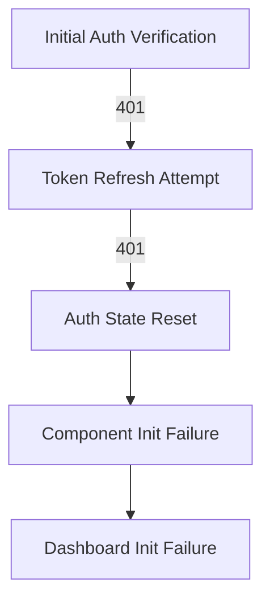

# Authentication Flow Fix Implementation Plan

## 1. Problem Analysis


## 2. Current Issues

1. Authentication Chain Failures:
   - Initial auth verification fails (401 Unauthorized)
   - Token refresh attempts fail (401 Unauthorized)
   - Auth state not properly maintained

2. Impact on Application:
   - Components fail to initialize
   - Dashboard initialization fails
   - User session not properly managed

## 3. Proposed Changes

### A. Token Management Enhancement

```javascript
const TokenManager = {
  accessToken: null,
  refreshToken: null,

  setTokens(access, refresh) {
    this.accessToken = access;
    this.refreshToken = refresh;
    sessionStorage.setItem('auth_state', JSON.stringify({
      hasTokens: true,
      timestamp: Date.now()
    }));
  },

  clearTokens() {
    this.accessToken = null;
    this.refreshToken = null;
    sessionStorage.removeItem('auth_state');
  }
};
```

### B. Enhanced API Request Handler

```javascript
async function apiRequest(url, method = 'GET', body) {
  const headers = {
    "Content-Type": "application/json",
    "Cache-Control": "no-cache"
  };
  
  if (TokenManager.accessToken) {
    headers["Authorization"] = `Bearer ${TokenManager.accessToken}`;
  }

  const response = await fetch(url, {
    method,
    headers,
    credentials: "include",
    body: body ? JSON.stringify(body) : undefined
  });

  if (!response.ok) {
    const error = new Error();
    error.status = response.status;
    
    try {
      const errorData = await response.json();
      error.message = errorData.message || response.statusText;
    } catch {
      error.message = response.statusText;
    }
    
    throw error;
  }

  return response.json();
}
```

### C. Improved Token Refresh Logic

```javascript
async function refreshTokenIfActive() {
  if (document.visibilityState !== "visible") return;
  
  try {
    // Clear flag to prevent infinite loops
    sessionStorage.removeItem('refreshing');
    
    console.log('Attempting token refresh...');
    const response = await apiRequest('/api/auth/refresh', 'POST');
    
    if (!response?.access_token) {
      throw new Error('Invalid refresh response');
    }

    TokenManager.setTokens(response.access_token, response.refresh_token);
    console.log('Token refresh successful');
    return true;
    
  } catch (error) {
    console.error('Token refresh failed:', error);
    
    // Only attempt reauth if not already trying
    if (!sessionStorage.getItem('refreshing')) {
      sessionStorage.setItem('refreshing', 'true');
      await updateAuthStatus();
      sessionStorage.removeItem('refreshing');
    } else {
      await logout();
    }
    
    return false;
  }
}
```

## 4. Implementation Steps

1. Create auth fix branch:
```bash
git checkout -b fix/auth-flow
```

2. Update auth.js:
   - Add TokenManager implementation
   - Enhance API request handling
   - Improve refresh token logic
   - Update state management functions

3. Testing Requirements:
   - Verify initial auth flow
   - Test token refresh mechanism
   - Validate session restoration
   - Confirm error handling
   - Check logout process

4. Monitoring Points:
   - Auth state transitions
   - Token refresh attempts
   - API request failures
   - Session validity checks

## 5. Success Criteria

1. Authentication Flow:
   - Successful initial auth verification
   - Working token refresh mechanism
   - Proper handling of auth failures
   - Correct session management

2. Error Handling:
   - Clear error messages
   - Recovery from token expiration
   - No refresh loops
   - Clean logout on failures

3. State Management:
   - Persistent auth state
   - Clean session handling
   - Clear UI transitions
   - Proper event broadcasting

## 6. Next Steps

After fixing the authentication flow:
1. Verify component initialization sequence
2. Update dashboard initialization logic
3. Implement proper dependency management
4. Add comprehensive error logging