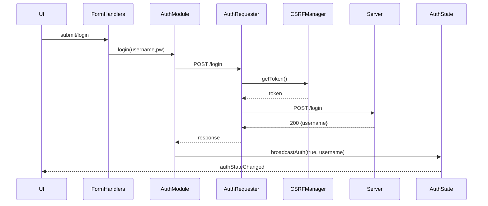
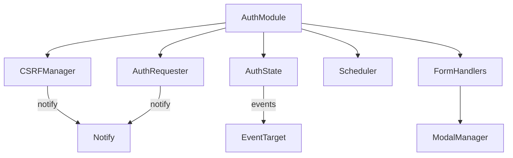

# Auth Module Full Refactor Plan

This document outlines the complete blueprint for refactoring `static/js/auth.js`.
The refactor addresses every linter warning and aligns the file with the project’s
strict-DI, security, and observability standards.

---

## Objectives

1. **Strict Dependency Injection** – eliminate all direct `window`, `document`, and `fetch` references.
2. **Single API Boundary** – route all HTTP requests through injected `apiRequest`.
3. **Security Hardening** – guarantee every DOM write passes through injected `sanitizer`.
4. **Observability** – wrap async flows with structured `notify` / `errorReporter`.
5. **Maintainability** – split large functions, isolate concerns, add JSDoc.
6. **Testability** – no timers or listeners at import-time, clean teardown paths.
7. **Backward Compatibility** – keep factory default export and `fetchCurrentUser` helper.

---

## Deliverables & File Layout

```text
static/js/auth/
├── index.js             # top-level factory (createAuthModule)
├── csrfManager.js       # createCsrfManager()
├── authRequester.js     # createAuthRequester()
├── authState.js         # createAuthState()
├── scheduler.js         # createScheduler() fallback wrapper
└── formHandlers.js      # createAuthForms()
```

### Module Responsibilities

| Module              | Purpose                                                                    |
|---------------------|----------------------------------------------------------------------------|
| **csrfManager.js**  | Fetch & cache CSRF token, expose `getToken()`.                             |
| **authRequester.js**| Compose headers, call `apiRequest`, handle errors.                         |
| **authState.js**    | Store auth flags, expose getters/setters, dispatch events.                 |
| **scheduler.js**    | Injected `setInterval` wrapper; returns `cancel()`.                        |
| **formHandlers.js** | Attach/detach DOM form listeners, update UI.                               |
| **index.js**        | Wires sub-modules, exposes publicAuth API & `cleanup()`.                   |

---

## Sequence Diagram



---

## Dependency Graph



---

## Milestones

1. **Scaffold** new folder & stub modules with validation helpers.
2. **Migrate CSRF logic** into `csrfManager.js`; write unit tests.
3. **Port requester** into `authRequester.js`; ensure header parity.
4. **Create auth state** module and broadcast logic.
5. **Implement scheduler** with injectable timer; fallback to global.
6. **Extract form handlers**; ensure sanitization & error flows.
7. **Rewrite index.js** to compose everything; expose same public API.
8. **Update imports** across codebase (`search_and_replace` step).
9. **Regression tests** for login/logout/register, periodic verify, cleanup, and `fetchCurrentUser`.

---

## Risk & Mitigation

* **Coupling** – search for legacy `createAuthModule` paths before file move.
* **Timer Injection** – provide default scheduler so browser code still works.
* **Legacy Calls** – maintain `export { fetchCurrentUser }` wrapper using injected `apiRequest` but fallback to direct fetch if none supplied.

---

## Acceptance Criteria

* All eslint warnings for `auth` folder resolved.
* Unit tests cover >90% of new modules.
* No visual regression in login/register flows.
* `publicAuth` API remains unchanged for consumers.

---

## Next Actions

1. Merge this plan.
2. Switch to **💻 Code** mode.
3. Implement Milestone 1–3 in small commits to avoid breaking auth flow.
