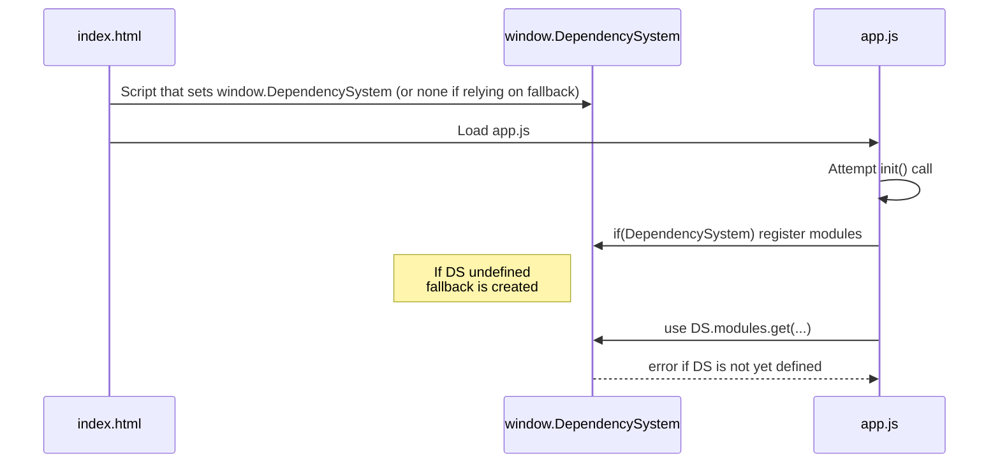

# Diagnosing and Fixing “Cannot read properties of undefined (reading 'get')” in app.js

---

## 1) Observed Problem

- The error “Cannot read properties of undefined (reading 'get')” typically means that `DependencySystem.modules` (or `DependencySystem` itself) is null/undefined when some code (often `DependencySystem.modules.get(…)`) tries to call it.
- The code in `static/js/app.js` has robust fallback logic to create a fallback DependencySystem, so normally we wouldn’t see this crash unless:
  - The script that defines `window.DependencySystem` is loaded too late (after app.js), or
  - The fallback initialization also fails, or is clobbered by another script, or
  - A certain part of app.js is accessed before the fallback can finish.

---

## 2) Root Causes to Check

**a) Script Load Order**
- Ensure that any script which sets `window.DependencySystem` runs before `app.js`.
- If you rely on the fallback alone, verify that no errors appear before the fallback code executes.

**b) Race Condition or Double-Initialization**
- `app.js` calls `init()` once the document is loaded. If the environment sets up `window.DependencySystem` after DOMContentLoaded, the fallback might not appear in time.
- `app.js` logs messages if it tries the fallback. Look for logs like `[App] Fallback DependencySystem created…`

**c) The Fallback Failing**
- The fallback system is created around lines 189–197 in `app.js`. If that code fails, `DependencySystem.modules` will still be undefined.
- Searching for “Failed to fix modules Map” or “Emergency fallback DependencySystem creation failed” logs can confirm the problem.

---

## 3) Step-by-Step Plan

1. **Check console logs for any relevant developer messages.**
   - Look for messages referencing “DependencySystem was not found on window object” or “FallbackDependencySystem created.”
   - Also see if the code eventually triggers “DependencySystem.modules.get is not a function.”

2. **Validate Script and DOM Load Order in HTML**
   - Ensure the script (or inline code) that sets `window.DependencySystem` is above `app.js`.
   - If you rely only on the fallback, see if some other script is overwriting `window.DependencySystem` after creation.

3. **Add Timestamps or Extra Debug Logs**
   - Optional: place `console.debug` statements around lines ~163–197 in `app.js` to confirm fallback is successfully assigned, or see if an error arises earlier.

4. **Temporarily Force a Known “DependencySystem” for Testing**
   - In your HTML, define a minimal version:
     ```html
     <script>
       window.DependencySystem = {
         modules: new Map(),
         waitFor() { ... },
         register() { ... }
       };
     </script>
     ```
   - Then load `app.js`. If the crash disappears, it’s load-order or incomplete initialization.

5. **Confirm Nothing Overwrites `window.DependencySystem`**
   - Possibly a script sets `window.DependencySystem = null;`.
   - Searching the codebase for `DependencySystem =` or `window.DependencySystem` can highlight references.

6. **After verifying script load order and ensuring that fallback or real `DependencySystem` is present, test again.**
   - If it still crashes, locate which line triggered “Cannot read properties of undefined (reading 'get')” and see if it’s referencing something other than `DependencySystem.modules`.

---

## 4) Plan Diagram (Mermaid)



---

## 5) Next Steps

1. Inspect your HTML to ensure the correct script load order.
2. Open dev tools to see logs from the moment `app.js` loads.
3. Confirm if fallback logs appear or if an error occurs prematurely.
4. Possibly define a minimal `DependencySystem` earlier in the HTML to see if that resolves the crash.

---

This plan outlines how best to approach diagnosing the error regarding “Cannot read properties of undefined (reading 'get')” in `app.js`.
