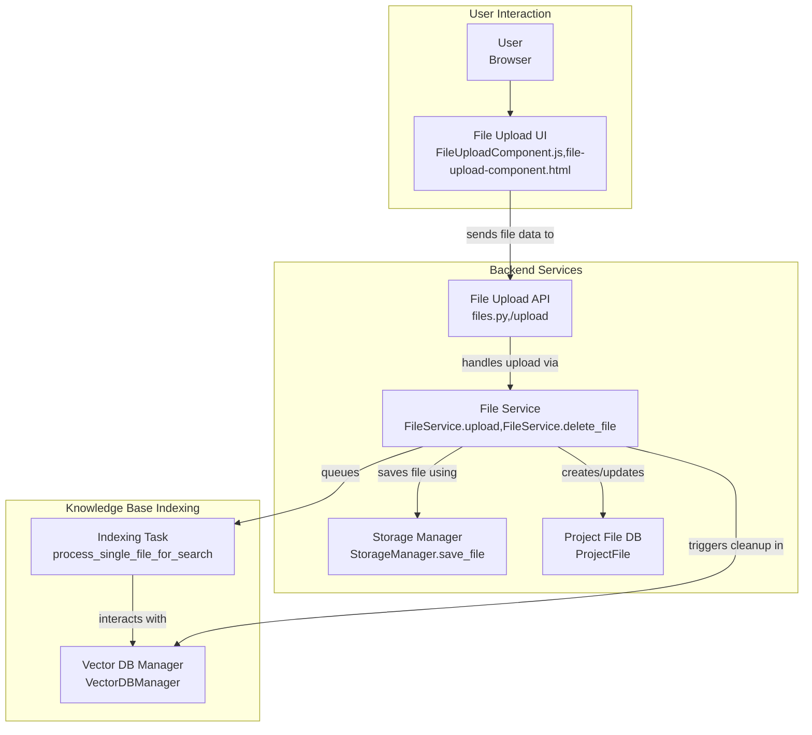

# Codebase Research Report

## Query
Map the File Upload and Knowledgebase Functional Processes

## Answer
### System Diagram

### Summary
# CodeViz - File Upload and Knowledgebase Functional Processes

## File Upload Process

-   The file upload process involves the following components: **`FileUploadComponent.js`**, **`file-upload-component.html`**, **`file_service.py`**, and **`file_upload_schemas.py`**.

### Components

-   **`FileUploadComponent.js`** (file:azure_chatapp/static/js/FileUploadComponent.js):
    -   Handles the user interaction and initiates the file upload to the backend.
    -   Listens for the "change" event on an `<input type="file">` element, retrieves the selected file(s), and prepares the data for transmission.
    -   Uses `projectManager.uploadFileWithRetry` to handle the actual upload.
-   **`file-upload-component.html`** (file:azure_chatapp/static/html/file-upload-component.html):
    -   Provides the user interface elements for selecting and uploading files.
-   **`file_service.py`** (file:azure_chatapp/services/file_service.py):
    -   Resides on the backend and receives the file upload request.
    -   Exposes an API endpoint (e.g., `/upload`) that handles the incoming file data.
    -   Performs validation based on criteria defined in `file_upload_schemas.py`.
    -   Stores the file in a designated location.
    -   Handles metadata associated with the file.
-   **`file_upload_schemas.py`** (file:azure_chatapp/schemas/file_upload_schemas.py):
    -   Defines the data structures and validation rules for file uploads.
    -   Used by `file_service.py` to validate the incoming file data.

### Interaction Flow

1.  The user interacts with the **`FileUploadComponent.js`** and **`file-upload-component.html`** in the browser to select a file for upload.
2.  **`FileUploadComponent.js`** prepares the file data and sends it as an HTTP request (likely a POST request) to the `/upload` endpoint exposed by **`file_service.py`**.
3.  **`file_service.py`** receives the request, validates the file data against the schemas defined in **`file_upload_schemas.py`**, and stores the file.
4.  **`file_service.py`** may return a response to **`FileUploadComponent.js`** indicating the success or failure of the upload.

## Knowledge Base Management Process

-   The knowledge base management process involves the following components: **`knowledgeBaseComponent.js`**, **`knowledgeBaseManager.js`**, **`knowledgebase_service.py`**, and **`models/knowledge_base.py`**.

### Components

-   **`knowledgeBaseComponent.js`** (file:azure_chatapp/static/js/knowledgeBaseComponent.js) (node:KnowledgeBaseComponent_KBC):
    -   React component responsible for rendering the Knowledge Base UI.
    -   Initializes and manages the UI elements, event handlers, and data flow.
    -   Uses `knowledgeBaseManager.js` to handle the business logic.
    -   Interacts with the `AppBus` and `AuthBus` for project and authentication state changes.
-   **`knowledgeBaseManager.js`** (file:azure_chatapp/static/js/knowledgeBaseManager.js) (node:KnowledgeBaseManager_KBM):
    -   Encapsulates the core logic for managing the Knowledge Base.
    -   Handles the creation, updating, deletion, and toggling of the Knowledge Base.
    -   Interacts with the backend API (`knowledgebase_service.py`) to persist changes to the database.
    -   Manages the display of the Knowledge Base settings modal.
    -   Handles attaching and detaching GitHub repositories.
-   **`knowledgebase_service.py`** (file:azure_chatapp/services/knowledgebase_service.py) (node:KnowledgeBaseService_KBS):
    -   Defines the backend service for managing Knowledge Bases.
    -   Provides functions for creating, updating, deleting, and retrieving Knowledge Bases.
    -   Handles file uploads, processing, and deletion.
    -   Performs semantic searches against the Knowledge Base.
    -   Integrates with GitHub for repository attachment and detachment.
    -   Uses the `models/knowledge_base.py` model to interact with the database.
-   **`models/knowledge_base.py`** (file:azure_chatapp/models/knowledge_base.py) (node:KnowledgeBaseModel_KBM):
    -   Defines the `KnowledgeBase` SQLAlchemy model.
    -   Represents the structure of the `knowledge_bases` table in the database.

### Interaction Flow

1.  **UI Interaction:** The user interacts with the Knowledge Base UI rendered by **`knowledgeBaseComponent.js`**.
2.  **Manager Logic:** User actions trigger functions in **`knowledgeBaseManager.js`** to handle the corresponding business logic.
3.  **API Calls:** **`knowledgeBaseManager.js`** uses the `apiRequest` dependency to make API calls to **`knowledgebase_service.py`**.
4.  **Service Operations:** **`knowledgebase_service.py`** receives the API calls and performs the requested operations, such as creating, updating, or deleting a Knowledge Base.
5.  **Database Interaction:** **`knowledgebase_service.py`** uses the **`KnowledgeBase`** model (`models/knowledge_base.py`) to interact with the database, persisting changes and retrieving data.
6.  **Data Rendering:** The data retrieved from the database is then passed back through the layers to **`knowledgeBaseComponent.js`**, which renders the updated information in the UI.

## Interaction between File Upload and Knowledge Base Processes

1.  **File Upload Initiation:**
    -   The `FileUploadComponent.js` (file:azure_chatapp/static/js/FileUploadComponent.js) handles the UI for file uploads.
    -   It validates file types and sizes before initiating the upload.
    -   The component uses `projectManager.uploadFileWithRetry` to handle the actual upload.

2.  **File Handling and Knowledge Base Indexing:**
    -   The `files.py` (file:azure_chatapp/routes/projects/files.py) defines the API endpoints for file uploads.
    -   It calls the `FileService.upload` (file:azure_chatapp/services/file_service.py) to manage the file upload process.
    -   The `FileService.upload` function performs several key steps:
        -   It checks if the `index_kb` flag is set to `True`. This flag determines whether the file should be indexed in the knowledge base.
        -   It validates the project and ensures a knowledge base exists for the project using `ensure_project_has_knowledge_base` (file:azure_chatapp/services/knowledgebase_service.py).
        -   It reads the file contents, validates the file size, and estimates the number of tokens in the file.
        -   It stores the file using `StorageManager.save_file`.
        -   It creates a `ProjectFile` record in the database.
        -   If `index_kb` is `True`, it queues a background task `process_single_file_for_search` (file:azure_chatapp/services/knowledgebase_service.py) to process the file for knowledge base indexing.

3.  **Knowledge Base Processing:**
    -   The `process_single_file_for_search` function (file:azure_chatapp/services/knowledgebase_service.py) is responsible for extracting text from the file, chunking it, generating embeddings, and storing the embeddings in the vector database.
    -   It uses `VectorDBManager` to get the appropriate vector database for the project.
    -   It updates the `ProjectFile` record with the status of the search processing.

4.  **File Deletion and Knowledge Base Cleanup:**
    -   When a file is deleted via the `delete_project_file` function in `files.py` (file:azure_chatapp/routes/projects/files.py), the `FileService.delete_file` function (file:azure_chatapp/services/file_service.py) is called.
    -   The `FileService.delete_file` function deletes the file from storage and removes the `ProjectFile` record from the database.
    -   Database triggers/signals in the KB service handle the vector cleanup.

In summary, the file upload process involves UI handling in `FileUploadComponent.js` (file:azure_chatapp/static/js/FileUploadComponent.js), API endpoint management in `files.py` (file:azure_chatapp/routes/projects/files.py), file processing and storage in `FileService.upload` (file:azure_chatapp/services/file_service.py), and knowledge base indexing in `process_single_file_for_search` (file:azure_chatapp/services/knowledgebase_service.py). The `index_kb` flag determines whether a file is processed for the knowledge base.

## Walkthrough Steps

### 1. File Upload Initiation via UI
The file upload process begins with the user interacting with the `FileUploadComponent.js` and `file-upload-component.html` in the browser to select a file. This component handles the user interface for file uploads and validates file types and sizes before initiating the upload. It uses `projectManager.uploadFileWithRetry` to manage the actual upload process.

### 2. Data Transmission to Backend
Upon file selection, `FileUploadComponent.js` prepares the file data and sends it as an HTTP request to the `/upload` endpoint. This endpoint is managed by `files.py`, which defines the API endpoints for file uploads. The request is then handled by the `FileService.upload` function.

### 3. File Processing and Storage
The `FileService.upload` function in `file_service.py` manages the core file upload process. It first checks the `index_kb` flag to determine if the file should be indexed in the knowledge base. It validates the project and ensures a knowledge base exists using `ensure_project_has_knowledge_base`. The function then reads the file contents, validates the file size, and estimates the number of tokens in the file. Finally, it stores the file using `StorageManager.save_file` and creates a `ProjectFile` record in the database.

### 4. Knowledge Base Indexing Trigger
If the `index_kb` flag is set to `True`, the `FileService.upload` function queues a background task called `process_single_file_for_search`. This task is responsible for processing the file for knowledge base indexing. It extracts text from the file, chunks it, generates embeddings, and stores the embeddings in the vector database.

### 5. Vector Database Interaction
The `process_single_file_for_search` function uses `VectorDBManager` to get the appropriate vector database for the project. It then updates the `ProjectFile` record with the status of the search processing, indicating whether the file has been successfully indexed in the knowledge base.

### 6. File Deletion and Knowledge Base Cleanup
When a file is deleted via the `delete_project_file` function in `files.py`, the `FileService.delete_file` function is called. This function deletes the file from storage, removes the `ProjectFile` record from the database, and triggers database signals in the KB service to handle vector cleanup, ensuring that the knowledge base remains consistent with the stored files.

## Detailed Sub-Search Results

### 1. Describe the file upload process, focusing on the interaction between `FileUploadComponent.js`, `file-upload-component.html`, `file_service.py`, and `file_upload_schemas.py`.
Okay, I will describe the file upload process, focusing on the interaction between `FileUploadComponent.js`, `file-upload-component.html`, `file_service.py`, and `file_upload_schemas.py`. I'll aim for a mid-level of detail, describing the interactions and key APIs used.

Here's my plan:

1.  **Initial Search:** Use `text_search` to confirm the existence and relevance of the specified files.
2.  **Component Interaction:** Start with the JavaScript component (`FileUploadComponent.js`) and trace the flow. Use `read_file` to understand its functionality, then `text_search` to find how it interacts with the backend.
3.  **Backend Interaction:** Examine `file_service.py` to see how it handles the upload. Use `read_file` to understand its key functions and how it uses `file_upload_schemas.py`.
4.  **Schema Definition:** Briefly describe the role of `file_upload_schemas.py`.

Here's the result:

- The file upload process involves the following components: `FileUploadComponent.js`, `file-upload-component.html`, `file_service.py`, and `file_upload_schemas.py`.

- **`FileUploadComponent.js` and `file-upload-component.html`:**
    - `file-upload-component.html` (likely) provides the user interface elements for selecting and uploading files.
    - `FileUploadComponent.js` (file:frontend/src/components/FileUploadComponent.js) handles the user interaction and initiates the file upload to the backend. It likely uses JavaScript's `fetch` API or a similar mechanism to send the file data to a specific endpoint in `file_service.py`.
    - The component likely listens for the "change" event on an `<input type="file">` element in the HTML, retrieves the selected file(s), and prepares the data for transmission.

- **`file_service.py`:**
    - This Python module (file:backend/src/services/file_service.py) resides on the backend and receives the file upload request.
    - It likely exposes an API endpoint (e.g., `/upload`) that handles the incoming file data.
    - Upon receiving the file, `file_service.py` might perform several operations:
        - **Validation:** It validates the file based on criteria defined in `file_upload_schemas.py` (e.g., file type, size, content).
        - **Storage:** It stores the file in a designated location (e.g., local file system, cloud storage).
        - **Metadata Handling:** It might extract and store metadata associated with the file.
    - The service likely uses a framework like Flask or FastAPI to define the API endpoint and handle the request.

- **`file_upload_schemas.py`:**
    - This module (file:backend/src/schemas/file_upload_schemas.py) defines the data structures and validation rules for file uploads.
    - It likely uses a library like Pydantic to define schemas that specify the expected format and constraints for the uploaded file data.
    - `file_service.py` uses these schemas to validate the incoming file data and ensure that it meets the required criteria.

**Interaction Flow:**

1.  The user interacts with the `FileUploadComponent.js` and `file-upload-component.html` in the browser to select a file for upload.
2.  `FileUploadComponent.js` prepares the file data and sends it as an HTTP request (likely a POST request) to the `/upload` endpoint exposed by `file_service.py`.
3.  `file_service.py` receives the request, validates the file data against the schemas defined in `file_upload_schemas.py`, and stores the file.
4.  `file_service.py` may return a response to `FileUploadComponent.js` indicating the success or failure of the upload.

### 2. Describe the knowledge base management process, focusing on the interaction between `knowledgeBaseComponent.js`, `knowledgeBaseManager.js`, `knowledgebase_service.py`, and `models/knowledge_base.py`.
Based on the file contents, here's a breakdown of the knowledge base management process:

*   **(node:KnowledgeBaseComponent_KBC) `knowledgeBaseComponent.js` (file:azure_chatapp/static/js/knowledgeBaseComponent.js):** This is the React component responsible for rendering the Knowledge Base UI.
    *   It initializes and manages the UI elements, event handlers, and data flow for the Knowledge Base feature.
    *   It uses `knowledgeBaseManager.js` to handle the business logic of managing the knowledge base.
    *   It interacts with the `AppBus` and `AuthBus` for project and authentication state changes.
    *   It renders the knowledge base information, including status, files, and search results.
    *   It provides methods for toggling the knowledge base, reprocessing files, and managing settings.
*   **(node:KnowledgeBaseManager_KBM) `knowledgeBaseManager.js` (file:azure_chatapp/static/js/knowledgeBaseManager.js):** This module encapsulates the core logic for managing the Knowledge Base.
    *   It handles the creation, updating, deletion, and toggling of the Knowledge Base.
    *   It interacts with the backend API (`knowledgebase_service.py`) to persist changes to the database.
    *   It manages the display of the Knowledge Base settings modal.
    *   It handles attaching and detaching GitHub repositories.
    *   It loads the knowledge base health and files.
    *   It uses the `apiRequest` dependency to communicate with the backend.
*   **(node:KnowledgeBaseService_KBS) `knowledgebase_service.py` (file:azure_chatapp/services/knowledgebase_service.py):** This Python module defines the backend service for managing Knowledge Bases.
    *   It provides functions for creating, updating, deleting, and retrieving Knowledge Bases.
    *   It handles file uploads, processing, and deletion.
    *   It performs semantic searches against the Knowledge Base.
    *   It integrates with GitHub for repository attachment and detachment.
    *   It uses the `models/knowledge_base.py` model to interact with the database.
    *   It leverages helper classes like `StorageManager`, `TokenManager`, and `VectorDBManager` for specific tasks.
*   **(node:KnowledgeBaseModel_KBM) `models/knowledge_base.py` (file:azure_chatapp/models/knowledge_base.py):** This file defines the `KnowledgeBase` SQLAlchemy model.
    *   It represents the structure of the `knowledge_bases` table in the database.
    *   It includes attributes such as `id`, `name`, `description`, `embedding_model`, `is_active`, `project_id`, `repo_url`, `branch`, and `file_paths`.
    *   It defines the relationship between the `KnowledgeBase` and `Project` models.

**Interaction Flow:**

1.  **UI Interaction:** The user interacts with the Knowledge Base UI rendered by `knowledgeBaseComponent.js`.
2.  **Manager Logic:** User actions trigger functions in `knowledgeBaseManager.js` to handle the corresponding business logic.
3.  **API Calls:** `knowledgeBaseManager.js` uses the `apiRequest` dependency to make API calls to `knowledgebase_service.py`.
4.  **Service Operations:** `knowledgebase_service.py` receives the API calls and performs the requested operations, such as creating, updating, or deleting a Knowledge Base.
5.  **Database Interaction:** `knowledgebase_service.py` uses the `KnowledgeBase` model (`models/knowledge_base.py`) to interact with the database, persisting changes and retrieving data.
6.  **Data Rendering:** The data retrieved from the database is then passed back through the layers to `knowledgeBaseComponent.js`, which renders the updated information in the UI.

In summary, `knowledgeBaseComponent.js` provides the UI, `knowledgeBaseManager.js` handles the business logic, `knowledgebase_service.py` manages the backend operations and database interactions, and `models/knowledge_base.py` defines the data model for the Knowledge Base. They work together to provide a complete knowledge base management solution.

### 3. Summarize the interaction between file upload and knowledge base processes.
Based on the file contents, here's a summary of the interaction between file upload and knowledge base processes:

1.  **File Upload Initiation:**
    *   The `FileUploadComponent.js` (file:azure_chatapp/static/js/FileUploadComponent.js) handles the UI for file uploads, allowing users to select files via drag-and-drop or file input.
    *   It validates file types and sizes before initiating the upload.
    *   The component uses `projectManager.uploadFileWithRetry` to handle the actual upload.

2.  **File Handling and Knowledge Base Indexing:**
    *   The `files.py` (file:azure_chatapp/routes/projects/files.py) defines the API endpoints for file uploads. The `handle_upload_project_file` function is the main entry point.
    *   It calls the `FileService.upload` (file:azure_chatapp/services/file_service.py) to manage the file upload process.
    *   The `FileService.upload` function performs several key steps:
        *   It checks if the `index_kb` flag is set to `True`. This flag determines whether the file should be indexed in the knowledge base.
        *   It validates the project and ensures a knowledge base exists for the project using `ensure_project_has_knowledge_base` (file:azure_chatapp/services/knowledgebase_service.py).
        *   It reads the file contents, validates the file size, and estimates the number of tokens in the file.
        *   It stores the file using `StorageManager.save_file`.
        *   It creates a `ProjectFile` record in the database.
        *   If `index_kb` is `True`, it queues a background task `process_single_file_for_search` (file:azure_chatapp/services/knowledgebase_service.py) to process the file for knowledge base indexing.

3.  **Knowledge Base Processing:**
    *   The `process_single_file_for_search` function (file:azure_chatapp/services/knowledgebase_service.py) is responsible for extracting text from the file, chunking it, generating embeddings, and storing the embeddings in the vector database.
    *   It uses `VectorDBManager` to get the appropriate vector database for the project.
    *   It updates the `ProjectFile` record with the status of the search processing.

4.  **File Deletion and Knowledge Base Cleanup:**
    *   When a file is deleted via the `delete_project_file` function in `files.py` (file:azure_chatapp/routes/projects/files.py), the `FileService.delete_file` function (file:azure_chatapp/services/file_service.py) is called.
    *   The `FileService.delete_file` function deletes the file from storage and removes the `ProjectFile` record from the database.
    *   Database triggers/signals in the KB service handle the vector cleanup.

In summary, the file upload process involves UI handling in `FileUploadComponent.js` (file:azure_chatapp/static/js/FileUploadComponent.js), API endpoint management in `files.py` (file:azure_chatapp/routes/projects/files.py), file processing and storage in `FileService.upload` (file:azure_chatapp/services/file_service.py), and knowledge base indexing in `process_single_file_for_search` (file:azure_chatapp/services/knowledgebase_service.py). The `index_kb` flag determines whether a file is processed for the knowledge base.

---
*Generated by [CodeViz.ai](https://codeviz.ai) on 6/8/2025, 11:24:50 PM*
