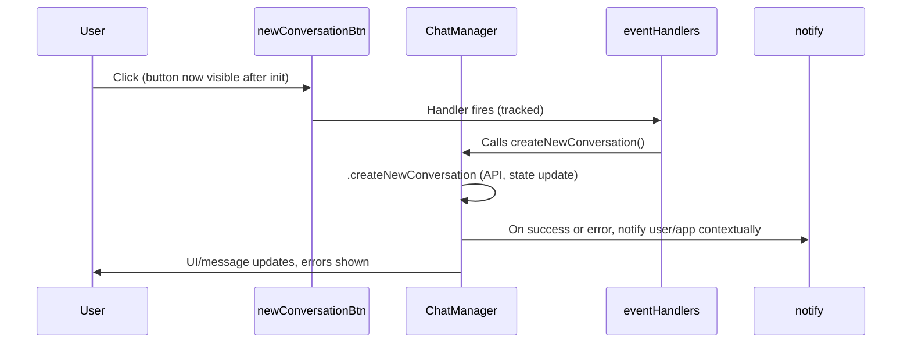

# Fixing the "New Chat" Button: UI Wiring, Event Handling, and DI Utilities

## **Problem Recap**

- The **New Chat/New Conversation** button is always hidden (`.hidden` class) and does not work, even when chat is available.
- Source: `<button id="newConversationBtn" class="hidden" data-requires-chat="true">New Conversation</button>`
- **Root cause:** It is never unhidden or wired up with an event listener by ChatManager or the UI orchestrator.

---

## **Goals**

1. Make the New Conversation button visible/enabled when chat is available.
2. Correctly wire its click event using modular event handler and DOM access utilities (injected via DI).
3. Ensure robust notification and teardown—in line with codebase standards.

---

## **Key Utilities Involved**

### domAPI (`@/static/js/utils/domAPI.js`)
- Provides all DOM accessors, fully injectable (never use `document` directly in ChatManager).
- Used to select, create, and manipulate DOM nodes.
- Examples:
  - `getElementById("newConversationBtn")`
  - `querySelector(selector)`
  - Maintain strict use of these methods for testability and isolation.

### eventHandlers (`@/static/js/eventHandler.js`)
- Provides all event listener logic via dependency injection.
- Key methods:
  - `trackListener(element, event, handler, opts)`: Wraps, tracks, and contextually manages handler binding.
  - `untrackListener(element, event, handler)`: Removes a previously tracked handler.
  - `cleanupListeners(targetOrOpts)`: Removes all listeners for a target or context, very important for teardown and preventing leaks/rebinding issues.
- Used *instead of* direct `element.addEventListener`.

**Why this matters**: This approach guarantees you can clean up (for teardown, hot-reload, or context switch) and track all handlers for debugging and test coverage.

---

## **Implementation Steps**

### 1. **Where to Add Logic**

In [`static/js/chat.js`](static/js/chat.js), inside `ChatManager.prototype.initialize()`—**after**:
- `this._setupUIElements(options)`
- `this._bindEvents()`

---

### 2. **Detailed Patch Example**

```javascript
const newConversationBtn = this.domAPI.getElementById("newConversationBtn");
if (newConversationBtn) {
  // Unhide when chat is initialized/authenticated:
  newConversationBtn.classList.remove("hidden");

  // Remove old handlers for this button (avoids leaks/double-wiring on reinit)
  if (typeof this.eventHandlers.cleanupListeners === 'function') {
    this.eventHandlers.cleanupListeners(newConversationBtn);
  }

  // Track the click handler (with DI utilities & context)
  this.eventHandlers.trackListener(
    newConversationBtn,
    "click",
    safeInvoker(async () => {
      try {
        await this.createNewConversation();
      } catch (err) {
        this._handleError("New Conversation Button", err);
        this._showErrorMessage("Failed to start new chat: " + (err?.message || err));
      }
    }, { notify: this.notify, errorReporter: this.errorReporter }),
    {
      description: "New Conversation Button",
      context: "chatManager",
      source: "ChatManager.initialize"
    }
  );
}
```

**Key Points:**
- `domAPI.getElementById()` ensures no direct `document` dependency.
- `eventHandlers.trackListener()` & `cleanupListeners()` ensure event is never double-bound or leaked, and is always removed on tear-down/rebind.
- `safeInvoker` wraps handler for notification/error propagation (with full context for tracing).
- Error/UI notifications use `this._handleError` and `this._showErrorMessage` per project notification guidelines.

---

### 3. **Design Diagram**



---

### 4. **Success Criteria**

- Button unhides when chat is initialized.
- Button always creates new conversation (using full DI, handles errors/teardown).
- UI and app notifications always work; no accidental double-binding or memory leaks.
- All code adheres to DI, modularity, and error-handling standards.

---

## **What Are domAPI and eventHandlers? (Quick Reference)**

- **`domAPI`**: Abstracts DOM operations; see [`static/js/utils/domAPI.js`](static/js/utils/domAPI.js:1).
- **`eventHandlers`**: Abstracts event listener management, cleanup, and diagnostics;
  see [`static/js/eventHandler.js`](static/js/eventHandler.js:1).
- These are injected into ChatManager (see its factory `createChatManager`), not globally imported.

---

## **Further Considerations**

- If UI orchestration for `[data-requires-chat]` elements becomes more complex, move this logic to a dedicated orchestrator/shell.
- If New Chat logic should only be enabled for certain project/chat modes, condition the code accordingly.
- Maintain full teardown (via `cleanup()`) to avoid memory leaks and event conflicts.

---

_Last reviewed: 2025-05-10. File generated by Roo "Architect" planning mode._
