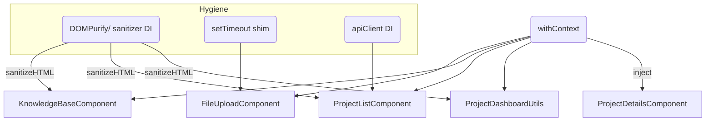

# Notification + Hygiene Refactor Blueprint

I pulled the additional lint / security findings into the original plan.
The scope now covers:

1. **Notification re-wiring** (canonical `notify.withContext` everywhere)
2. **Hygiene fixes flagged by the linter review:**
   - **No `window.*`, `console.*`, `alert/prompt/confirm`, raw `fetch`, raw `setTimeout` hacks**
   - **All `innerHTML` assignments go through injected `sanitizer` (`DOMPurify.sanitize`)**
   - **Functions > 40 LOC split for readability**
   - **Exports follow factory-function or class pattern—no ambiguous `export default X` if the code contradicts the pattern**

---

## File-by-File Action List

### 1. static/js/projectDetailsComponent.js
✅ Notification work already planned.
🆕 Hygiene tasks
- Line 126/127 `_html` / `_clear`: keep helper but rename to `_htmlSafe` & `_clearSafe` with explicit sanitizer usage; never expose `innerHTML` directly elsewhere.
- Audit for any other raw `innerHTML` (none found).
- The two helpers remain < 40 LOC, no split needed.

---

### 2. static/js/projectDashboardUtils.js
✅ Notification plan items.
🆕 Hygiene tasks
- **Window Globals:** Remove comment ambiguity on line 11; ensure the implementation never touches `window.*`.
- **Unsafe `innerHTML`:** Within `createUIUtils` line 76 we already pipe through `sanitizeHTMLContent`; rename helper to `_safeSetInnerHTML` and enforce `DOMPurify`.
- **Oversized functions:**
  - `createUIUtils` (~90 LOC) ⇒ break into three helpers:
    - `createElementAdvanced` (core)
    - `applyCommonProps` (dataset, attributes)
    - `wireEventHandlers`
  - `setupEventListeners` ⇒ extract sub-helpers: `bindEditButton`, `bindPinButton`, `bindArchiveButton`.
  - `createProjectDashboardUtils` ⇒ factor out `resolveDependencies` and `bootstrap`.
- No `window.*` references; keep guard.
- Verify every `innerHTML` path goes through sanitizer.

---

### 3. static/js/projectListComponent.js
✅ Notification plan items (replace `this.notification` wrapper with `this.notify.withContext`).
🆕 Hygiene tasks
- **Sanitization:** All five `innerHTML` writes already call `this.sanitizer.sanitize`. Keep; rename `_setElementHTML` to `_safeSetInnerHTML`.
- **Browser confirm:** Line 618 uses `this.notify.confirm` (DI); that is OK—just ensure context tags.
- **Raw `fetch`:** Line 108 fallback fetch → replace with injected `apiClient` only; if missing, log `notify.error` (context). Remove the direct `fetch`.
- **Oversized functions:** Split `_bindFilterEvents` (>40 LOC) and `_createProjectCard` (>100 LOC) into smaller helpers (`keyboardNavigationHandler`, `buildCardHeader`, `buildCardFooter`, etc.).
- Remove `this.notification` wrapper and any residual console output.

---

### 4. static/js/knowledgeBaseComponent.js
✅ Notification plan items.
🆕 Hygiene tasks
- **Window globals:** Ensure comment lines 102/109 are descriptive only—code already reads from `options.DependencySystem`; confirm no `window.*`.
- **Sanitization:** All `innerHTML` writes already call `DOMPurify.sanitize`. Keep and centralize via `setSanitizedHTML` helper (rename to `_safeSetInnerHTML`).
- **Oversized helpers:**
  - `setSanitizedHTML` (>40 LOC) → trim; core logic ≤15 LOC.
  - Move `_renderSearchResults`, `_createResultItem`, `_showResultDetail` into separate private module or utils if possible.
- **Raw `setTimeout`:** Debounce helper uses `setTimeout`; keep (documented), but add DI’d `scheduler` shim so tests can stub it.
- **Default export mismatch:** Replace `export default createKnowledgeBaseComponent;` with `export { createKnowledgeBaseComponent };` to keep named exports only (or wrap into `export default function(options){…}` for clarity).

---

### 5. static/js/FileUploadComponent.js
✅ Notification plan items.
🆕 Hygiene tasks
- Remove fallback `console.error`; instead `notify.error` with context `"fileUploadComponent"`.
- `setTimeout` (progress-bar cosmetic): move to injected `scheduler` util or add comment + DI parameter to allow stubbing in tests.
- Default export mismatch: either keep `export class` **only** or change to `export function createFileUploadComponent(opts){ return new FileUploadComponent(opts); }`.
- Ensure no references to `window.*`. Current lines 2-15 are only doc comments; implementation is clean.

---

### 6. static/js/app.js (new-scope item)
- Remove any remaining `window.notify` wiring; ensure `DependencySystem` publishes a single canonical `notify` instance used by all consumers.

---

## General Implementation Checklist

1. **Sanitizer Injection**
   Inject `DOMPurify` into any module that sets `innerHTML`. Provide fallback error if missing.

2. **Scheduler Injection**
   For `setTimeout` / debounce helpers, allow injection of `scheduler` (defaults to native) to make unit-testing deterministic.

3. **API Client Injection**
   Replace *all* direct `fetch` calls with injected `apiClient` or existing `app.apiRequest`.

4. **Remove Window / Console**
   Validate with `search_files` regex for `window\.` and `console\.` after refactor.

5. **Split Oversized Functions**
   Target < 40 LOC chunks; add JSDoc & unit tests for new helpers.

6. **Unit-Test Hooks (optional)**
   - Provide bare Jest stubs for each new helper.
   - Mock `notify` and `sanitizer` to assert correct usage.

7. **Lint & CI**
   Run ESLint; fix any rule violations introduced by the split or DI rewiring.

---

## Mermaid Overview



---

## High-Level Design

```mermaid
graph LR
  subgraph Notification Core
    notifyFactory["utils/notify.js<br>createNotify()"] -->|injects| notifyInstance((notify))
  end

  subgraph Components
    PDC["ProjectDetailsComponent"]
    PDU["projectDashboardUtils"]
    PLC["ProjectListComponent"]
    KBC["KnowledgeBaseComponent"]
    FUC["FileUploadComponent"]
  end

  notifyInstance -->|withContext(...) per module| PDC
  notifyInstance --> PDU
  notifyInstance --> PLC
  notifyInstance --> KBC
  notifyInstance --> FUC

  class PDC,PDU,PLC,KBC,FUC module;
```

**Legend**
- All five target modules obtain the same singleton `notify` via DI from the orchestrator or DependencySystem.
- Each module wraps it immediately with `notify.withContext({context, module})` and never calls raw `notify.*` afterward.
- Every outbound call supplies `{ group: true, context, module, source }` (or is pre-mixed by the wrapper).

---

## File-by-File Actions (Detailed)

1. **projectDetailsComponent.js**
   - Constructor: replace `this.notify = notify;` with `this.notify = notify.withContext({ context: "projectDetailsComponent", module: MODULE });`
   - Review all outbound notify calls for direct usage. Refactor as needed (rare).
   - Ensure any child (e.g., FileUploadComponent) receives *the wrapped* notify.

2. **projectDashboardUtils.js**
   - Use `notify.withContext` for all notification helpers.
   - Remove any dev/legacy fallback to DependencySystem for notifications.
   - All notification helpers and event hooks wired post-wrap.

3. **projectListComponent.js**
   - Delete any custom notification abstraction.
   - Wire notify at the top as described.
   - Refactor all notify points.
   - Replace any browser confirmation with DI-based confirm or log via notify.
   - Remove raw fetch and all references to console.

4. **knowledgeBaseComponent.js**
   - Require notify via DI.
   - Wire notify at creation time, centralized helper.
   - All direct error/info flows through this wrapper.

5. **FileUploadComponent.js**
   - Require notify; use wrapped.
   - No console fallback.
   - Wire all as above.

---

## Cross-Cutting Integration

- `static/js/app.js` (or DI root):
  - Instantiate/supply a single notify instance.
  - Remove any reference to global/window notify or `app.showNotification`.
  - Enforce DI; no access to notify as a global.

---

## Validation / Done Criteria

- No `showNotification` usage outside notification-handler.
- No `console.` in refactored components.
- ESLint passes.
- Manual smoke test: see context/grouped notifications in UI across modules.

