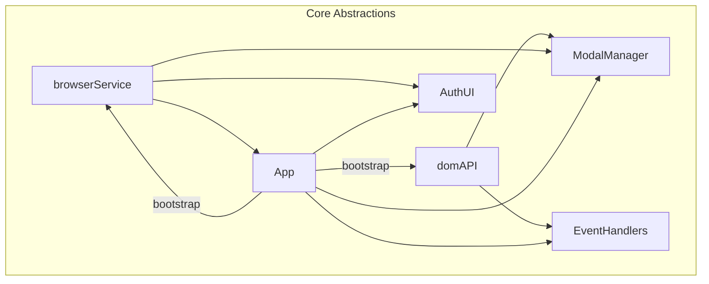

# JS UI Refactor Plan — domAPI / browserService Injection and Globals Removal

_Last updated: 2025-05-06_

---

## 1. Create/Extend Core Abstractions

- **`domAPI`** (already used in `chat.js`). Add helpers if missing:
  - `.getElementById`, `.querySelector`, `.querySelectorAll`, `.createElement`, `.getBody`, `.getDocumentElement`, `.getScrollingElement`.
- **`browserService`**: extend to support:
  - `FormData`, `MutationObserver`, and a `fetch` wrapper for static/HTML requests.
- Register both in `DependencySystem` during bootstrap/init.

---

## 2. Refactor All Modules Still Using Globals

### A. `modalManager.js`
- Inject `{ domAPI, browserService }` into the `createModalManager()` factory.
- Replace all direct `document.*`, `window.*` with injected DOM/browserService methods.
- Move `getScrollingElement` utility to `domAPI`.

### B. `eventHandler.js`
- Accept `{ domAPI, browserService }` in `createEventHandlers()`.
- Replace all direct DOM lookups and element access (every `document.getElementById`, `document.querySelector`, etc.) with `domAPI` methods.
- Replace any direct `MutationObserver` usage with `browserService.MutationObserver`.

### C. Other Modules (projectDashboardUtils.js, app.js, FileUploadComponent.js ...)
- Sweep for remaining direct DOM/Browser API usage.
- Refactor to inject and use `domAPI` or `browserService` as above.

#### Example Refactor
```js
// BEFORE
const modalEl = document.getElementById(modalId);

// AFTER
const modalEl = domAPI.getElementById(modalId);
```

---

## 3. Move Inline-Script Logic Into Proper Modules

- Create `authUI.js` (or similar) — move `setupModalTabs`, password validation there.
- Hook: Call `authUI.init()` from the app bootstrap **after** firing the `modalsLoaded` event.
- Remove all inline setup, and duplicate/legacy `setupModalTabs` from `eventHandler.js`.

---

## 4. Centralize HTML Fetching (remove direct global fetch)

- Add `browserService.fetch()` wrapper (same signature as `fetch`).
- Refactor all direct `fetch('/static/html/…')` in `app.js` and elsewhere to use injected `browserService.fetch`.
- `apiRequest` (for API calls) remains unchanged.

---

## 5. Ordered Bootstrap in App

- In `initializeCoreSystems()`:
  - `DependencySystem.register('domAPI', domAPIImpl)`
  - `DependencySystem.register('browserService', browserServiceImpl)`
  - Then construct modalManager, eventHandlers, authUI.

---

## 6. Testability & Cleanup

- Update domAPI/browserService mocks in unit tests.
- Verify `eventHandlers.cleanupListeners` unregisters all events for SPA reload friendliness.

---

## High-Level Dependency Flow (mermaid)



---

## Implementation Sequence

1. **Extend abstractions:** Add helpers/unit tests for domAPI and browserService.
2. **modalManager.js:** Remove globals, inject DI.
3. **eventHandler.js:** Same ("globalsweep"), then delete setupModalTabs.
4. **app.js loader:** Use injected browserService.fetch for HTML.
5. **Full sweep:** Regex/manual replace in `projectDashboardUtils.js`, `FileUploadComponent.js`, etc.
6. **QA pass:** Jest + Playwright, verify modals/auth flow.

---

**Approval:**
Plan reviewed and approved as of 2025-05-06.
